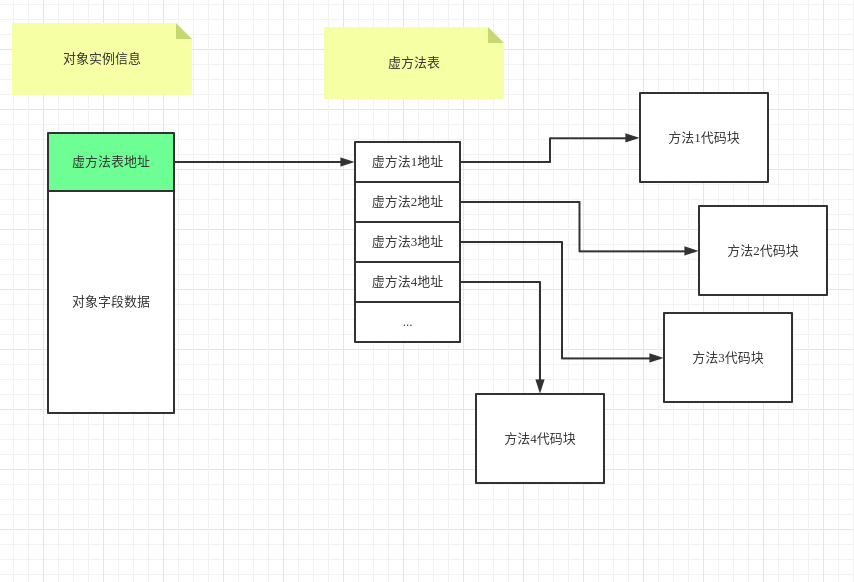
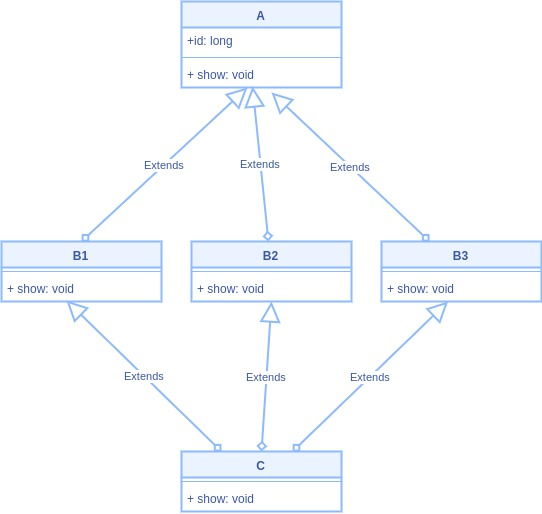
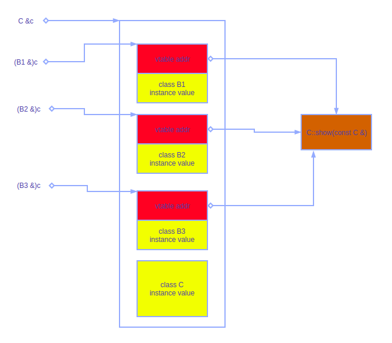
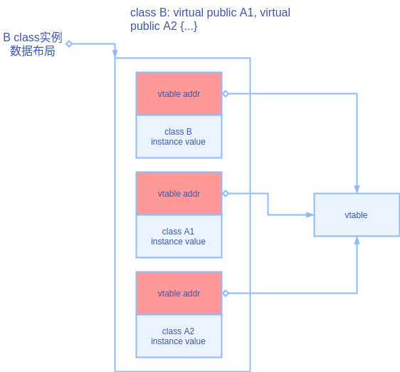
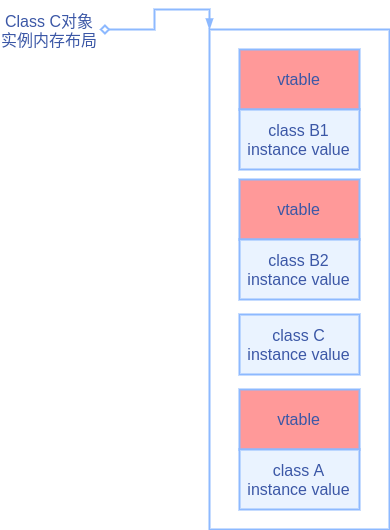
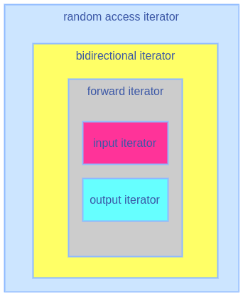
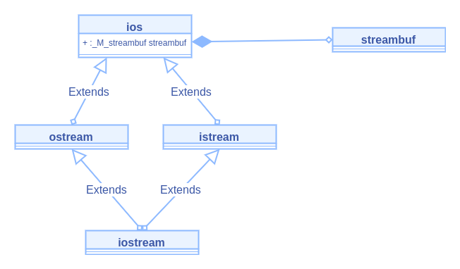

# 1. Setting Out to C++

## 1.1 C++ Initiation

### 1 demo

   ```cpp
   // myfirst.cpp -- displays a message
   #include <iostream> // a PREPROCESSOR directive
   int main() // function header
   { // start of function body
       using namespace std; // make definitions visible
       cout << "Come up and C++ me some time."; // message
       cout << endl; // start a new line
       cout << "You won’t regret it!" << endl; // more output
       return 0; // terminate main()
   } // end of function body
   ```

### 2. 头文件-Header Filenames

c++头文件多以.hpp或.hxx为后缀

| Kind of Header | Convention             | Example      | Comments                                                     |
| -------------- | ---------------------- | ------------ | ------------------------------------------------------------ |
| C++ old style  | Ends in .h             | *iostream.h* | Usable by C++ programs                                       |
| C old style    | Ends in .h             | *math.h*     | Usable by C and C++ programs                                 |
| C++ new style  | No extension           | *iostream*   | Usable by C++ programs, uses namespace std                   |
| Converted C    | c prefix, no extension | *cmath*      | Usable by C++ programs, might use non-C features, such as namespace std |

### 3. 命名空间-Namespace

1. 如果使用iostream的方式引入，则在使用其中的头文件时，需要带上std 命名空间

   ```cpp
   #include <iostream>
   // 使用方式1
   std::cout;
   
   // 使用方式2
   using namespace std;
   cout;
   ```

### 4. Using cin

从标准输入流中读取数据

```cpp
using namespace std;
int carrots = 0;
cin >> carrots;
```


# 2. Dealing With Data

## 2.1 Simple Variables

### 1.变量命名规则

1. 两个下滑线开头，或者一个下划线+大写字母，者两种变量名预留给编译期使用，代码中不要使用此类变量名
2. 一个下划线+小写字母，用户可以用作全局变量名

### 2. Interget Type

1. 各种类型
   1. char, unsigned char
   2. short, unsigned short
   3. int, unsigned int
   4. long, unsigned long

2. 各种类型最大值/最小值在limit.h这个头文件中定义了

   ```cpp
   CHAR_WIDTH
   SHRT_WIDTH
   INT_WIDTH
   LONG_WIDTH
   
   UCHAR_MAX
   USHRT_MAX
   UINT_MAX
   ULONG_MAX
   ```

3. sizeof函数，可获取对应数据类型占用内存大小

   

### 3. Initialization

```cpp
int x = 5; // c初始化方式

// c++可以采用的如下初始化方式
int y(99); 
int y = {99};
int y{99};

int rocs = {}; // set rocs to 0
int psychics{}; // set psychics to 0

```

1. 尽量在声明变量时就初始化

### 4. Integer Iterals

1. 将数字以十六进制/八进制格式化输出

   ```cpp
       int a = 100;
   
       cout << hex;
       cout << a << endl;
   
       cout << oct;
       cout << a << endl;
   
       cout << dec;
       cout << a << endl;
   ```

### 5. Char Type

1. 读取char

   ```cpp
   char c;
   std::in >> c;
   ```

2. 输出一个char

   ```cpp
   char c = 'M';
   std::cout.put(c);
   ```

3. 转译字符

   - \n, \t, \r
   - 十六进制 ```'\xff'```, ```"a\x4dm"```
   - 八进制 ```'\x77'```

4. Universal Character Names

   ```cpp
   // 可以使用\u+四位十六进制数
   // 或\U+八位十六进制数
   int k\u00F6rper;
   cout << "Let them eat g\u00E2teau.\n";
   ```

5. wide character-```wchar_t```

   - 当char无法表示的字符时，可以用wchar_t代替，比如中文字
   - wchar_t占用四个字节，使用时加上L前缀
   - 不建议再使用，可用char32_t或char16_t替代

   ```cpp
   wchar_t c = L'你';
   cout << sizeof(c) << endl;
   cout << hex;
   cout << c << endl;
   ```

6. New C++11 Types: ```char16_t``` and ```char32_t```

   - char16_t字符前加上u
   - char32_t字符前加上U
   
   ```cpp
   char16_t c16 = u'你';
   char32_t c32 = U'你';
   
   char32_t ch2 = U'\U0000222B'
   ```

### 6. The bool Type

1. bool代表值：true(=1), false(=0)
2. bool类型占用内存: 1B

```cpp
bool b1 = true;
bool b2 = false;
```

## 2.2 The const Qualifier

## 2.3 C++ Arithmetic Operators

### 1. Initialization Conversions When {} Are Used (C++11)

c++对采用列表初始化的方式初始化时，要求比较严格，要求初始化的值要被```const```修饰

```cpp
const int code = 66;
int x = 66;
char c1 {31325}; // narrowing, not allowed
char c2 = {66}; // allowed because char can hold 66
char c3 {code}; // ditto
char c4 = {x}; // not allowed, x is not constant
x = 31325;
char c5 = x; // allowed by this form of initialization
```

### 2. Conversions in Expressions

1. 小类型向大类型转，比如short转int
2. 整数向小数转，比如int转float
3. 有符号向无符号转，比如 int 转向unsigned int

### 3. 类型强转换

有三种种书写方式， 其中static_cast<>的使用场景要求更加严格

```cpp
(typeName) value // converts value to typeName type
typeName (value) // converts value to typeName type
static_cast<typeName> (value) // converts value to typeName type
```

### 4. 类型推断-auto

c++可以通过右表达式推断左侧数据类型

```cpp
auto n = 100; // n is int
auto x = 1.5; // x is double
auto y = 1.3e12L; // y is long double
```

# 4. Compound Types

## 4.1 Introducing Arrays

### 1. 初始化数组

```cpp
short things[] = {1, 5, 3, 8};
long totals[500] = {0};

// c++11数组初始化
unsigned int counts[10] = {}; // all elements set to 0
float balances[100] {}; // all elements set to 0
```

## 4.2 Strings

### 1. String 定义

string必须是以```\0```结尾

```cpp
char dog[8] = { 'b', 'e', 'a', 'u', 'x', ' ', 'I', 'I'}; // not a string!
char cat[8] = {'f', 'a', 't', 'e', 's', 's', 'a', '\0'}; // a string!
const char *s = "tom"; // a string

char bird[11] = "Mr. Cheeps"; // the \0 is understood
char fish[] = "Bubbles"; // let the compiler count
```

### 2. Reading String Input a Line at a Time

```cpp
// 方法1
cin.getline(name, ArSize); // reads through newline, it doesn’t save the newline character.

// 方法2
char name[size] = {0};
cin.get(name, size); 
cin.get(); // cin.get方法不会读取换行符，因此再次读取前需要先将多余换行符过滤掉, 或者用这种写法：cin.get(name, ArSize).get();
cin.get(name, size)；
    
// 注意
int year;
cin >> year; // 读取完后，会在输入流剩下一个换行符，因此需要改成(cin >> year).get()
```

尽量使用get方法替代getline方法

### 3. Empty Lines and Other Problems

cin.clear(), 清空输入流

## 4.3 Introducing the string Class

使用string class前要包含<string>头文件，已经它再std命名空间下

### 1. 初始化

```cpp
string str1; // create an empty string object
string str2 = "panther"; // create an initialized string

cin >> str1; // str1 resized to fit input
```

### 2. C++11 String Initialization

```cpp
char first_date[] = {"Le Chapon Dodu"};
char second_date[] {"The Elegant Plate"};
string third_date = {"The Bread Bowl"};
string fourth_date {"Hank's Fine Eats"};
```

### 3. Assignment, Concatenation, and Appending

1. assignment

    ```cpp
    string str1; // create an empty string object
    string str2 = "panther"; // create an initialized string
    str1 = str2; // VALID, object assignment ok
    ```

2. concatenation

   ```cpp
   string s1 = "hello";
   string s2;
s2 = s1 + s1;
   ```
   
3. 获取字符串长度

    ```cpp
    string s1 = "hello";
    int len = s1.size();
    ```

### 4. More on string Class I/O

```cpp
string str;
getline(cin, str); // cin now an argument; no length specifier
```

### 5. Other Forms of String Literals

其他类型的string格式化

1. raw string, 不转译特殊字符，支持字符串内换行

   ```cpp
   string rawStr = R"(你好\n"tom" 先生)"; // 输出 你好\n"tom" 先生
   ```

2. 如果raw string中包含```(```或```)```的处理方式，搭配```+*```

   ```cpp
   string rawStr = R"+*("(Who wouldn't?)", she whispered.)+*";
   ```

## 4.4 Introducing Structure

### 1. 定义与使用

```cpp
struct person {
    char name[40];
    int age;
};

person p1; // 注意，c++在使用struct结构时，可以不用加上struct关键字
```

### 2. 初始化

```cpp
// c支持的方式初始化
struct person p1 = {
    age: 12,
    name: "leborn",
};

static struct person leborn = {"king", 35};

// c++11支持的初始化方式
static struct person leborn {"king", 35};
```

### 3. Bit Fields in Structures

c++对bit位的精细定义

```cpp
struct torgle_register
{
    unsigned int SN : 4; // 4 bits for SN value
    unsigned int : 4; // 4 bits unused
    bool goodIn : 1; // valid input (1 bit)
    bool goodTorgle : 1; // successful torgling
};
```

## 4.5 Union

对一块内存数据的不同解释

使用场景大部分时为了节省内存, 通过类型字段判断存储的是何种数据

```cpp
struct widget
{
    char brand[20];
    int type;
    union // anonymous union
    {
        long id_num; // type 1 widgets
        char id_char[20]; // other widgets
    };
};
```

## 4.6 Enumeration

### 1. 定义

```cpp
enum spectrum {red, orange, yellow, green, blue, violet, indigo, ultraviolet};

enum bits {one = 1, two = 2, four = 4, eight = 8}; // 给每个枚举值设置特定的值
```

### 2. 使用

```cpp
spectrum band; // band a variable of type spectrum
band = red;
```


## 4.7 Pointers and the Free Store

### 1. Pointers and Numbers

1. 指针不是数字

2. 不能直接将数字类型赋值给指针，必须强转

   ```cpp
   int * pt;
   pt = 0xB8000000; // invalide
   
   int * pt;
   pt = (int *) 0xB8000000; // types now match
   ```

### 2. Allocating Memory with new

1. 通过new关键字时间堆内存的分配

   ```cpp
   // 使用格式
   typeName * pointer_name = new typeName;
   
   // 案例
   int *p = new int;
   ```

### 3. Freeing Memory with delete

通过delete关键字释放堆内存, delete一个空指针是安全的

```cpp
int * ps = new int; // allocate memory with new
// use the memory ....
delete ps; // free memory with delete when done
```

### 4. Using new to Create Dynamic Arrays

使用new 关键字创建一个数组

```cpp
type_name * pointer_name = new type_name [num_elements];

int *arr = new int [12]; // 分配一个数组
arr[1] = 8; // 使用数组
delete [] arr; // 释放数组
```

## 4.8 Pointers, Arrays, and Pointer Arithmetic

## 4.9 Array Alternatives

### 1. The vector Template Class

```cpp
vector<typeName> vt(n_elem); // 定义一个初始容量为n_elem的vector
vector<typeName> vt; // 定义一个初始容量为0的vector

vector<double> vd(n); // create an array of n doubles
```

### 2. The array Template Class

```cpp
// 定义格式
array<typeName, n_elem> arr;

array<int, 5> ai; // create array object of 5 ints
array<double, 4> ad = {1.2, 2.1, 3.43. 4.3};
```


# 5. Loops and RelationalExpressions
## 5.1 Introducing for loops

### 1. 对string的遍历

1. 常规for循环遍历

   ```cpp
   string s = "hello";
   for(int i = 0; i < s.size(); i++) {
       cout << s[i] << endl;
   }
   ```

2. foreach循环遍历

   ```cpp
   string s = "hello";
   for(char c: s) {
       cout << c << endl;
   }
   ```

## 5.2 关系比较运算

1. Comparing C-Style Strings

   c类型字符串不能使用```==```来直接比较两个字符串是否相等，要使用```strcmp```来判断

2. Comparing string Class Strings

   由于c++中string对```==```运算符进行了重载，因此可以直接使用```==```来对比


## 5.3 The Range-Based for Loop (C++11)

```cpp
// 单纯的遍历
double prices[5] = {4.99, 10.99, 6.87, 7.99, 8.49};
for (double x : prices)
	cout << x << std::endl;

// 遍历的同时修改其值
for(double &x : prices)
    x *= 2;

// 遍历某个固定数组
for (int x : {3, 5, 2, 8, 6})
	cout << x << " ";
```

## 	 5.4 Loops And Text input

### 1. 判断EOF

1. 先尝试读取一个字符

2. 通过```fail```或者```eof```函数来判断

    ```cpp
    cin.get(ch); // attempt to read a char
    while (cin.fail() == false) // test for EOF
    {
        cout << ch; // echo character
        ++count;
        cin.get(ch); // attempt to read another char
    }
    ```

3. 可采用简化判断方式

   ```cpp
   void read2() {
       char ch;
       cout << "清随意输入：" << endl;
       while(!cin.get(ch).fail()) {
           cout << "读取到：" << ch << " " << (int) ch << endl;
       }
   
   }
   ```

4. 通过传统c方式判断

    ```cpp
    int ch;
    while((ch = cin.get()) != EOF) {
        cout << "读取到：" << (char)ch << " " << ch << endl;
    }
    ```

    

# 6. Branching Statements and Logical Operators
## 6.1 Writing to a Text File

```cpp
#include <iostream> // 引入头文件
#include <fstream>

using namespace std;

int main(int argc, char const *argv[])
{
    ofstream fout; // 定义一个文件流
    fout.open("a.txt"); // 打开文件
    fout << "hello"; // 输出
    fout.write(" world", 6); // 输出

    fout.close(); // 关闭文件流
    return 0;
}

```

## 6.2 Reading from a Text File

### 1. 打开案例

```cpp
#include <iostream>
#include <fstream>

using namespace std;

int main(int argc, char const *argv[])
{
    ifstream fin;
    fin.open("a.txt");
    
    char buf[1024];
    fin.get(buf, 1023);
    
    fin.close();

    return 0;
}
```

### 2. 其他api

```cpp
fin.is_open(); // 判断文件是否正常打开
fin.eof(); // 判断文件是否结束
fin.good(); // 判断文件是否正常读取
fin.fail(); // 判断是否读取失败
```


# 7. Functions: C++’s Programming Modules


# 8. Adventures in Functions

## 8.1 C++ Inline Functions

内联函数避免了函数的调用过程，提升性能。但inline函数要足够短小

### 1. 使用案例 

```cpp
inline int square(int x) {
    return x * x;
}


int show(int x) {
    int c = square(x);
    return c + 10;
}
```

在使用g++时，只有开启编译后化后，才会进行编译内联

```shell
$> g++ -S -Og inline.cpp
```

## 8.2 Reference Variables-引用型数据类型

### 1. 使用案例

```cpp
int a = 8;
int &b = a; // 其时b中存储的是a的地址值

b = 12;
cout << a; // 此时a已经变成了66
```

```asm
movl	$8, -20(%rbp)	#, a
leaq	-20(%rbp), %rax	#, tmp89
movq	%rax, -16(%rbp)	# tmp89, b; 此时b中存储的是a的地址值
movq	-16(%rbp), %rax	# b, tmp90
movl	$12, (%rax)	#, *b_3
```

*引用型变量必须在声明时初始化， 声明和初始化不允许分开*

```cpp
int rat;
int & rodent;
rodent = rat; // No, you can't do this.
```

### 2. References as Function Parameters

引用型数据类型通常用使用在方法形参，等价于指针传递

1. ref类型数据作为非const修饰的形参，调用的时候一定要传递的时左值表达式

   ```cpp
   double refcube(int &a) {
       a *= a * a;
       return a;
   }
   
   double z = refcube(x + 3.0); // should not compile
   refcube(5); // should not compile
   ```

2. 如果ref类型数据作为const修饰的形参，或者类型不匹配时，调用时传递了非左值表达式时，调用时采用临时变量的模式

   ```cpp
   double refcube(const int &a) {
       a *= a * a;
       return a;
   }
   
   double z = refcube(x + 3.0); // ok，此时创建一个临时变量，将x+3.0放入其中，再调用refcube函数
   refcube(5); // ok，此时创建一个临时变量，将5放入其中
   
   double d = 5.0;
   cuberef2(d); // ok, 此时类型不匹配，采用临时变量传递的方式
   ```

### 3. Reference as Function Return

1. 表现形式

   ```cpp
   const int& gen_int() {
       int *a = new int;
       *a = 12;
       return *a;
   } 
   ```

2. 接受方式

   - 采用非引用类型接收，会将返回数据复制到新分配的栈空间

     ```cpp
     int b = gen_int(); // b的地址在栈中,存在复制过程
     ```

   - 采用引用类型接收

     ```cpp
     int &b = gen_int(); // b的地址位于堆中，不存在复制过程
     ```

3. Why Use const with a Reference Return?

   如果不是使用const修饰，函数调用可能成为左值表达式

   ```cpp
   gen() = 5; // 语法奇特，不便理解，且无意义
   ```

4. 特殊案例分析

   ```cpp
   // 案例1：ok
   string version1(const string & s1, const string & s2)
   {
       string temp; 
       temp = s2 + s1 + s2;
       return temp; // 理论上temp分配在version1方法的栈上，但实际上编译期在生存version1方法时，多传递了一个result_ptr指针
   }
   
   // 案例2: 错误案例
   string & concat3(string & s1, string & s2) {
       string temp = s1 + s2;
       // cout << "temp: " << &s1 << endl;
       return temp; // 编译报错，不能返回local变量的地址值
   
   }
   ```

### 4. 使用Reference Arguments的原因

- To allow you to alter a data object in the calling function
- To speed up a program by passing a reference instead of an entire data object

## 8.3 Default Arguments

在方法声明时，可以为参数指定一个默认值，有默值参数形参后面的参数也必须带默认值

```cpp
int harpo(int n, int m = 4, int j = 5); // VALID
int chico(int n, int m = 6, int j); // INVALID
int groucho(int k = 1, int m = 2, int n = 3); // VALID
```

## 8.4 Function Overloading

### 1. 简介

1. 方法的重写包含:
   1. 参数类型不一致(typedef要还原到原有类型比较)
   2. 参数数量不一致

2. 编译后，生成的方法名称其时不一样

3. 方法一旦重写后，参数类型必须完全匹配

   ```cpp
   void f1(int a) {
       cout << "int " << a << endl;
   }
   
   void f1(long a) {
       cout << "long " << a << endl;
   }
   
   unsigned int x = 9;
   f1(x); // 编译不通过
   ```

4. 参数类型，和引用型参数类型在重写场景下，认为时一致的

   ```cpp
   void f1(int x);
   void f1(int & x); // 编译报错，不认为和上面函数是重写关系
   ```

5. 参数一样，但返回值不一样不认为是重载，这两个方法不允许同时存在

## 8.5 Function Templates-泛型
### 1. 使用案例

```cpp
template <typename t>
void swap(t &a, t &b) {
    t tmp = a;
    a = b;
    b = tmp;
}

// 在C++98前，使用class替代typename
template <class t>
void swap(t &a, t &b) {
    t tmp = a;
    a = b;
    b = tmp;
}
```

1. 定义函数模板的时候，不会真的创建函数，只有在使用的时候才会创建

2. 通过方法的重载实现

3. 每一种使用类型，就会编译器会为其创建一个函数

   ```cpp
   int a = 1;
   int b = 3;
   swap(a, b); // 创建一个函数名为：_Z4swapIiEvRT_S1_
   
   double d1 = 2.0;
   double d2 = 4.0;
   swap(d1, d2); // 创建一个函数名为：_Z4swapIdEvRT_S1_
   ```

### 2. Overloaded Templates-重载模板
模板可以像方法一样重载

### 3. Explicit Specializations
1. 当精确声明的方法和模板重叠时，以精确申明的为准

   ```cpp
   template <typename T>
   void func(T &t) {
       cout << "func template" << endl;
   }
   
   void func(int &i) {
       cout << "func explic" << endl;
   }
   
   int a = 9;
   func(a); // 调用的是非模板方法
   ```

2. 指定模板类型的方法重写函数

   ```cpp
   template <typename T>
   void func(T &t) {
       cout << "func template" << endl;
   }
   
   // 模板指定精确类型
   // explicit specialization for the job type
   template <>
   void func<double>(double &d) {
       cout << "func double" << endl;
   }
   
   double a = 9.0;
   func(a); // 调用的是精确类型模板方法
   ```

3. 方法选择优先级: 非模板方法>精确模板>模板

### 4. Instantiations and Specializations

```cpp
// 模板：没有调用，就不会生成具体的方法，调用的时候会implicit template instantiation
template <typename T>
void Swap(T &t1, T &t2) {

}

// explicit instantiation for char
// 不需要调用就可以生成char类型的具体方法
template void Swap<char>(char &, char &);

//  explicit specialization for job
// 不需要调用就可以生成int类型的具体方法, 重写了模板方法
template <> void Swap<int>(int &, int &) {
    
}
```

### 5. Exact Matches and Best Matches

c++会将有些参数类型视为相同，比如```void f(int a)```和```void f(int &a)```, 这个两个方法签视为相同，不算重载。所以这两个方法不能同时存在

具体的相同方式有：

| From an Actual Argument | To a Formal Argument    |
| ----------------------- | ----------------------- |
| Type                    | Type &                  |
| Type &                  | Type                    |
| Type []                 | * Type                  |
| Type (argument-list)    | Type (*)(argument-list) |
| Type const              | Type                    |
| Type volatile           | Type                    |
| Type *                  | const Type *            |
| Type *                  | volatile Type *         |

1. 针对指针和引用类型的形参, non-const类型更倾向于匹配non-const的类型

2. 非指针和引用类型的形参无此倾向

3. 当有两个模板都可以匹配时，倾向于更精确匹配的模板

   ```cpp
   template <class Type> void recycle (Type t); // #1
   template <class Type> void recycle (Type * t); // #2
   
   struct blot {int a; char b[10];};
   blot ink = {25, "spots"};
   recycle(&ink); // 虽然#1模板和#2模板都可以匹配，但与#2模板匹配度更高，因此用#2模板
   ```

## 8.6 The decltype Keyword (C++11)
使用案例

```cpp
int x;
decltype(x) y; // 定义一个变量y, 使其和x具有一样的类型

decltype(x + y) xpy = x + y; // 可以是表达式
long indeed(int);
decltype (indeed(3)) m; // m is type int， 也可以是函数，indeed函数不会真被执行，只是用于推断类型
```

编译期确定其具体数据类型

## 8.7 Alternative Function Syntax (C++11 Trailing Return Type)
1. c++11支持将返回值方法头部的尾巴上指定，具体语法：

```cpp
double h(int x, float y);
// 可以替换成如下语法
auto h(int , float y) -> double;
```

2. 当在模板方法中无法确定值类型时，可以采用新型语法代替某个值类型

```cpp
template <typename T>
auto add(T t1, T t2) -> decltype(t1 + t2)
{
    return t1 + t2;
};
```


# 9. Memory Models and Namespaces
## 9.1 Separate Compilation
### 1. 拆分方式

- 头文件
- 目标文件
- 引用的文件

### 2. 头文件通常包含的内容

- Function prototypes
- Symbolic constants defined using ```#define``` or ```const```
- Structure declarations
- Class declarations
- Template declarations
- Inline functions

## 9.2 Storage Duration, Scope, and Linkage
### 1. Scope and Linkage
作用域：

- local scope
- global scope
- class scope
- namespace scope

### 2. Static Duration Variables
```cpp
int global = 1000; // static duration, external linkage
static int one_file = 50; // static duration, internal linkage

void funct1(int n)
{
    static int count = 0; // static duration, no linkage
    int llama = 0;
}
```

### 3. Initializing Static Variables

- zero-initialization: ```int x;```
- constant-expression initialization: ```int x = 7 + 8```
- dynamic initialization: ```int x =  4.0 * atan(1.0);```

### 4. Static Duration, External Linkage
1. 引用一个其他文件的全局变量

```cpp
extern int blem; // blem defined elsewhere
```

2. 局部可通过```::```来访问全局变量

   ```cpp
   int age = 18;
   
   int main(int argc, char const *argv[])
   {
       int age = 9;
   
       cout << "local age: " << age << endl; // 访问的是局部变量，输出9
       cout << "global age: " << ::age << endl; // 访问的是全局变量，输出18
       return 0;
   }
   
   ```

3. 每个函数优先使用函数所在文件的全局变量

### 4. Specifiers and Qualifiers

1. storage class specifiers, 修饰变量存储的关键字

    - auto
    - register
    - static
    - extern
    - thread_local
    - mutable
    
2. cv-qualifiers:

     - const
     - volatile

3. mutable关键字用于表示某个值可以改变，即使被const修饰

    ```cpp
    struct data
    {
        char name[30];
        mutable int age;
    };
    
    const data d = {"jerry", 20};
    strcpy(d.name, "tom"); // 编译报错
    d.age++; // 由于被mutable修饰，编译不报错
    ```

4. 关于const的特殊性，在c++(not c)中，如果全局变量被const修饰，等价于同时加上了static修饰，也就是说其他文件中无法引用到这个变量，解决方法

    - 将const修饰的变量放入头文件中

      ```cpp
      // file.hpp
      const int count;
      ```

    - 定义const的地方加上extern修饰

      ```cpp
      // file1.cpp
      extern int count = 19;
      
      // 使用方 file2.cpp
      extern int count;
      cout << cout;
      ```

### 5. Functions and Linkage

    static修饰的函数只能在本文件中使用

### 6. Language Linking

1. 采用c++的编译方式后，方法名会添加额外的部分，比如```add2```这个方法编译后，可能就变成了```_Z4add2ii```

2. 可以显示指定c++文件采用c的方式来查找链接/编译方法

   1. 当c++需要引用外部c库时

       ```cpp
       // 可以这样声明外部c库中方法原型
       extern "C" int add(int, int);
       ```

   2. 指定将某个方法采用c的编译方式

      ```cpp
      extern "C" {
          void fun2() {
        		cout << "fun2" << endl;
          }
      }
      ```
      

### 7. Storage Schemes and Dynamic Allocation

1. 通过```new```或```malloc```申请的堆内存称之为动态内存

2. 通过```new```分配内存

   ```cpp
   int *arr1 = new int[10];
   int *iptr = new int;
   
   int *pi = new int(6); // 创建一个int型变量，并初始化为6
   int *arr = new int[3]{1, 2, 9}; // 创建并初始化数组
   
   struct where {double x; double y; double z;};
   where * one = new where {2.5, 5.3, 7.2}; // 创建并初始化一个struct
   
   double * pdo = new double {99.99}; // *pd set to 99.99
   ```

3. new: Operators, Functions, and Replacement Functions

   ```cpp
   // new 申请内存时，可重写这个两个方法
   void * operator new(std::size_t); // used by new
   void * operator new[](std::size_t); // used by new[]
   
   // delete 销毁内存时，可重写这个两个方法
   void operator delete(void *);
   void operator delete[](void *);
   ```

4. 指定new对象锁所在的内存

   ```cpp
   char buf[1024];
   int main() {
       int *p = new (buf) int[20]; // 以buf为开始地址，申请内存.
       delete [] p; // 运行时报错，data区域的数据，不能delete
   }
   ```

## 9.3 Namespaces

### 1. 创建namespace

```cpp
// 定义, 命名空间中可以包含：方法，变量，struct,等等
namespace ns1
{
    struct person {
        char name[40];
        int age;
    };
    int grade;
    int add(int a, int b) 
    { 
        return a + b;
    };
}

// 使用
ns1::grade = 9;
```

### 2. New Namespace Features
1. namespace不能在方法中定义

2. namespace只能在全局位置定义，namespace可以嵌套在namespace中

   ````cpp
   namespace ns1 {
       int a;
       namespace ns {
           char c;
       }
   }
   ````

3. namespace可以追加定义

   ```cpp
   namespace ns1
   {
       int name;
   }
   
   namespace ns1
   {
       int len;
   }
   // 最终导致ns1中有两个属性
   ns1::name = 1;
   ns1::len = 10;
   ```

### 3. namespace结合using关键字的使用

1. using 可以放置在方法外部

   ```cpp
   using namespace std;
   ```

2. using 可以放置在方法内部

   ```cpp
   void f() {
       using namespace std;
   }
   ```

3. using 同样有其作用域

4. 可以通过using引入某一个具体变量

    ```cpp
    int main() {
        using std::cout;
        cout << "hello";
    }
    ```
    
5. 当方法内部变量和全局变量名字相同时，可以通过```::value```这个方式获取全局变量值

    ```cpp
    int age = 90;
    void f() {
        int age = 100;
        std::cout << age; // 输出100
        std::cout << ::age; // 输出90
    }
    ```

6. 不建议直接使用using namespace整个空间，这样容易和本地变量冲突

### 4. namespace其他特性

1. using 嵌套的namespace方式

   ```cpp
   namespace n1 {
       namespace n2 {
           // ...
       }
   }
   
   using namespace n1::n2;
   ```

2. using关键字也可以用在namespace中

   ```cpp
   namespace n1 {
       using std::cout;
       using std::endl;
   }
   ```

3. 可以给namespace起别名

   ```cpp
   namespace na1 = std;
   namespace na2 = n1::n2;
   ```

### 5. unnamed namespace

1. 声明

   ```cpp
   namespace // unnamed namespace
   {
       int ice;
       int bandycoot;
   }
   ```

2. unnamed namespace等价于using namespace xxx

3. unnamed namespace里面的元素相当于加上了static前缀

### 6. 使用namespace的指导意见

1. 通过using namesapce中定义的变量，代替直接extern外部全局变量
2. 通过在unnamed namespace中定义变量，代替直接定义static全局变量
3. 如果是在开发一个库，将他们都放入到自己定义好的namespace中
4. 不要在头文件中使用using
5. using namespace的作用范畴和引入内容尽可能的少

# 10. Object and Class

## 10.1 oop的特性:

- 抽象
- 继承
- 封装
- 多态
- 重用

## 10.2 Abstraction and Classes

1. class中的member和function可以被public, protected, private修饰

2. 未加修饰符时，默认为private修饰

3. 案例

   ```cpp
   // 声明
   class Stock {
   private:
       long shares;
       string company;
       double share_val;
       double total_val;
       void set_total() {
           total_val = share_val * shares;
       }
   
   public:
       void buy(long number, double price);
       void sell(long number, double price);
       void update(double price);
       void show();
   };
   
   // 将class中的方法实现
   void Stock::buy(long number, double price) {
       // cout << "Stock.buy: " << number << ", " << price;
       shares += number;
       share_val = price;
       set_total();
   }
   
   void Stock::sell(long number, double price) {
       shares -= number;
       share_val = price;
       set_total();
   }
   // ...
   ```

4. 类中的 memeber function也可以是inline方法

   ```cpp
   // 1. 直接在类的内部声明为inline
   class Stock {
   private:
   	// ...
       inline void set_total() {
           total_val = share_val * shares;
       }
       // ...
   };
   
   // 2. 也可以先声明，后实现
   class Stock {
   public:
   	// ...
       void set_total();
       // ...
   };
   inline void Stock::set_total() {
           total_val = share_val * shares;
   }
   ```

## 10.3 Class Constructors and Destructors

### 1. 声明和定义构造器

1. 构造器，用于memeber data的初始化，是一个没有返回值的特殊方法

   ```cpp
   class Stock {
       public:
       Stock(const string &company, double price, long count);
   }
   
   Stock::Stock(const string &company, double price, long count) {
       this->company = company;
       this->price = price;
       this->count = count;
   
       this->total = price * count;
   }
   ```

2. 和普通方法一样有两种实现方式

   1. 在类的定义代码块中直接实现构造器

   2. 在类的定义代码块中声明构造器，在类的外部实现构造器方法


### 2. 构造器的使用:

   ```cpp
   Stock s("kingdee", 18, 100);
   Stock & s2 = Stock("alibaba", 200, 10);
   Stock *s3p = new Stock("tencent", 80, 30); 
   ```

### 3. 默认构造器

1. 当类中没有构造器时，会默认有一个空参构造器; 如果有显式定义了构造器，则不会添加默认的构造器

2. 构造器允许重载

   ```cpp
   class Stock {
       public:
       Stock(const string &company, double price, long count);
       Stock() {};
   }
   ```

### 4. 析构函数(Desctructor)

当某个对象被手动销毁，或者超出对象的作用域时，会自动值型析构函数，用于对象销毁后的**内存清理**工作

1. destructor函数和constructor函数定义方式类似

   ```cpp
   class Stock {
       ~Stock() {
           cout << "destructor..." << endl;
       }
   }
   ```

2. 析构函数必须是空参

3. 析构函数调用时机

   - 全局静态对象，程序退出时调用
   - 局部遍历对象，超出作用域(退出代码块)时调用
   - 使用new关键字创建的对象，手动执行delete操作时，调用析构函数

4. 当没有显式创建一个析构函数时，编译器会自动添加一个默认的析构函数

### 5. C++11列表方式初始化

```cpp
Stock s4 = {"alibaba", 200, 10};
Stock s5 {"alibaba", 200, 10};
Stock s6 {};
Stock *s7p = new Stock{"alibaba", 200, 10};
```

### 6. 关于const member function

```cpp
const Stock s("tencent", 9, 10);
s.show(); // 编译报错，因为编译器不确定在show方法中，是否对类的member data发生了修改
```

解决办法: 将show定义为const方法

```cpp
void show() const; // promises not to change invoking object
void stock::show() const // promises not to change invoking object
```

## 10.4 this对象指针关键字

this关键字代表的时当前对象的指针，它通过方法参数列表隐藏的一个参数传递进来

```cpp
// 使用案例1
Stock::Stock(const string &company, double price, long count) {
    this->company = company;
    this->price = price;
    this->count = count;

    this->total = price * count;
}

// 使用案例2
Stock & add(long count) {
    this->count += count;
    return *this;
}
```

## 10.5 对象数组

1. 数组声明时，就创建对象

   ```cpp
   Stock stocks[4]; // 声明时，创建对象，所以调用4次无参构造函数
   ```

2. 定义数组时使用显式的构造方法

   ```cpp
   const int STKS = 10;
   Stock stocks[STKS] = {
       Stock("NanoSmart", 12.5, 20),
       Stock(),
       Stock("Monolithic Obelisks", 130, 3.25),
   };
   ```

## 10.6 类的作用域(class scope)

### 1. class内部的常量声明

1. 通过enum类型声明

   ```cpp
   class Bakery {
       private:
       enum {Months = 12};
       double costs[Months];
   }
   ```

2. 通过static const修饰变量

   ```cpp
   class Bakery {
       private:
       static const Months = 12;
       double costs[Months];
   }
   ```

### 2. 枚举类(enum class)

枚举类可构建自己独立的作用域，用于解决不同枚举变量之间的冲突问题

1. 定义

    ```cpp
    enum class egg {Small, Medium, Large, Jumbo};
    enum class t_shirt {Small, Medium, Large, Xlarge};
    ```

2. 使用

   ```cpp
   egg e = egg::Medium;
   t_shirt t = t_shirt::Large;

   if(e == egg::Medium) {
       cout << "egg equal medium" << endl;
   }
   
   if(e < egg::Large) {
       cout << "egg  less than large" << endl;
   }
   ```
   

# 11. Working with Classes

## 11.1 操作符重载(operator overloadings)

1. 操作符重载函数格式

    ```cpp
    operator+op(argument-list);
    operator+(); // 重载+号运算符
    operator-(); // 重载-号运算符
    operator[](); // 重载[]运算符
    ```

2. 重载案例

   ```cpp
   class Time
   {
   private:
       int hours;
       int minutes;
   
   public:
       Time(){};
       Time(int hours, int minutes)
       {
           this->hours = hours;
           this->minutes = minutes;
       }
       
       Time operator+(const Time &t) const { // 编译后，生成的方法名字为: _ZNK4TimeplERKS_
           Time result;
           int addmins = this->minutes + t.minutes;
           result.hours = this->hours + t.hours + addmins / 60;
           result.minutes = addmins % 60;
           return result;
       }
   };
   ```

3. 使用

   ```cpp
   Time t1 = Time(8, 30);
   Time t2 = Time(3, 40);
   Time t3 = Time(5, 50);
   Time t4 = t1 + t2 + t3;
   Time t6 = t1.operator+(t2);
   ```

4. 同一个操作符允许多次重载, 类型不限制，但操作数的前后顺序有关系

    ```cpp
    // 重新定一个Time类和int相加的操作符
    // 编译后，等价于生成的方法： Time _ZNK4TimeplEi(Time &t, int min);
    Time Time::operator+(const int min) const
    {
        Time result;
        int mins = this->minutes + min;
        result.minutes = mins % 60;
        result.hours = this->hours + mins / 60;
    
        return result;
    }
    
    // 使用
    Time t1 = Time(8, 30);
    Time t5 = t1 + 40; // yes
    Time t6 = 40 + t1; // no, 编译报错
    ```

5. 操作符重载的一些限制

    - 操作符的第一位操作数一定是当前方法所在的类类型

    - 重载后的操作符，使用时也不能为反操作符的基本语法

    - 不能创造一些不存在的操作符

    - 不能重载的操作符有: 

      - sizeof
      - . 
      - .* 
      - :: 
      - ?: 
      - typeid 
      - const_cast 
      - dynamic_cast
      - reinterpret_cast
      - static_cast

    - 只能在member function中重载的操作符

      - =
      - ()
      - []
      - ->

    - 其他操作符均可在member function和non-member function中重载

      |  +   |  -   |  *   |   /    |   %    |     ^     |
      | :--: | :--: | :--: | :----: | :----: | :-------: |
      |  &   |  \|  |  ~   |   !    |   =    |     <     |
      |  >   |  +=  |  -=  |   *=   |   /=   |    %=     |
      |  ^=  |  &=  | \|=  |   <<   |   >>   |    >>=    |
      | <<=  |  ==  |  !=  |   <=   |   >=   |    &&     |
      | \|\| |  ++  |  --  |   ,    |  ->*   |    ->     |
      |  ()  |  []  | new  | delete | new [] | delete [] |

## 11.2 友元相关介绍(introducing friends)

1. 一般情况下，类中的private修饰的内容只有在类的内部才能访问，但在友元模块中，也可以访问private, 友元模块有：
      - 友元函数(friend function)
      - 友元类(friend class)
   - 友元成员函数(friend member function)
2. 友元函数可用于操作符的重载，确保有些操作(+, *)可以满足交换率

### 1. 创建友元函数

1. friend function特性
   - 在类中声明，但不是member function,
   - 可以访问到类中的private元素

2. 案例

   ```cpp
   class Time
   {
   public:
       friend Time operator+(int min, const Time &t) {
           return t + min;
       }
   };
   ```

### 2. <<操作符的重载

```cpp
// 定义
class Time
{
private:
    int hours;
    int minutes;

public:
    Time(){};
    Time(int hours, int minutes)
    {
        this->hours = hours;
        this->minutes = minutes;
    }

    friend std::ostream & operator<<(std::ostream &out, Time &t) {
        out << t.hours << ":" << t.minutes;
        return out;
    }
};

// 使用
Time t1 = Time(8, 30);
cout << "t1=" << t1 << endl;
```

标准格式：

```cpp
ostream & operator<<(ostream & os, const c_name & obj)
{
    os << ... ; // display object contents
    return os;
}
```

## 11.3 成员函数与非成员函数在操作符重载上的对比(Overloaded Operators: Member Versus Nonmember Functions)

1. 通过成员函数重载

   ```cpp
   Time operator+(const Time & t) const; // member version
   ```

2. 通过友元函数重载, 注意，有些操作符不能通过非成员函数重载，比如```[], ->```等

   ```cpp
   // nonmember version
   friend Time operator+(const Time & t1, const Time & t2);
   ```

## 11.4 类型转换(Automatic Conversions and Type Casts for Classes)

### 1. 构造器隐式转换

1. 当有一个参数的构造器时，可使用如下方式调用构造器，相当于类型转换

   ```cpp
   class Stone
   {
   private:
       static const int Lbs_per_stone = 14;
       int stone;
       double pds_left;
       double pounds;
   public:
       Stone(double lbs);
   };
   
   Stone::Stone(double lbs) {
       pounds = lbs;
       stone = (int)lbs / Lbs_per_stone;
       pds_left = lbs - stone * Lbs_per_stone;
   }
   
   Stone s = 56.9; // 调用了一个参数的构造器，相当于将double转成Stone类
   ```

2. 可以俄构造器前加上```explicit```关键字，则不允许隐式转换; 此举可以避免一些错误

   ```cpp
   explicit Stone(double lbs);
   Stonewt myCat; // create a Stonewt object
   myCat = 19.6; // not valid if Stonewt(double) is declared as explicit
   mycat = Stonewt(19.6); // ok, an explicit conversion
   mycat = (Stonewt) 19.6; // ok, old form for explicit typecast
   ```

### 2. 转换函数(Conversion Functions)

1. 通过转换函数，可以将当前类转变成其他类型

2. 当没有转换函数时，使用强转会报错

3. 书写格式

   ```cpp
   operator typeName();
   
   // 案例
   class Stone
   {
   private:
       static const int Lbs_per_stone = 14;
       int stone;
       double pds_left;
       double pounds;
   public:
   	// 返回基本类型
       operator double() {
           return this->pounds;
       }
       // 返回引用类型
       operator string&() {
           return *new string("hello ref");
       }
       // 返回指针类型
       operator string*() {
           return new string("hello point");
       }
   };
   
   // 使用
   Stone wolfe(285.7);
   double d = wolfe; // 隐式转换
   double d2 = (double)wolfe; // 显式转换
   double d2 = double(wolfe); // 显式转换
   ```

4. 转换函数的要求

   - 必须是类的成员函数
   - 不能指定一个返回值类型
   - 必须是空参

5. 禁用隐式转换

   ```cpp
   explicit operator double() {
           return this->pounds;
   }
   
   // 使用
   Stone wolfe(285.7);
   double d = wolfe; // 隐式转换，no, 编译报错
   double d2 = (double)wolfe; // 显式转换，yes
   double d2 = double(wolfe); // 显式转换, yes
   ```

6. 谨慎使用隐式转换，建议使用显示转换

### 3. Conversions and Friends
1. 类型自动转换发生在成员函数的行参上，而不会发生在成员函数的调用者上

# 12. 类和动态内存分配(Classes and Dynamic Memory Allocation)

## 12.1 动态内存和类(Dynamic Memory and Classes)

### 1. 静态成员变量

```cpp
class StringBad
{
private:
    char * str;
    int len;
public:
    static int num_strings;
    StringBad(const char *s);
    StringBad();
    ~StringBad();
    friend std::ostream & operator<<(std::ostream &out, StringBad &sb) {
        out << sb.str;
        return out;
    }
};

StringBad::StringBad() {
    len = 3;
    str = new char[len+1];
    strcpy(str, "C++");
    num_strings++;
}

StringBad::~StringBad()
{
    // 释放内存
    delete [] str;
}

// 初始化静态成员变量
int StringBad::num_strings = 0;
```

1. 静态成员变量只初始化一次，必须在类的外部初始化，初始化方式:

   ```cpp
   int StringBad::num_strings = 0;
   ```

2. 如果成员变量是通过new出来的，必须要在析构函数中释放对应的内存

3. 如果以值传递的方法时，如果有复制构造器，会调用它；如果没有复制构造器，则不会主动调用构造器，但会调用析构函数

   ```cpp
   // 如果没有StringBad::StringBad(Stringbad)构造器时，不会调用其他构造器，只会直接复制内存数据
   void call(StringBad sb) {
       std::cout << "call " << sb << ", addr: " << (void *)sb.str << std::endl;
   }
   
   // 等价于使用了这个构造器StringBad s3 = StringBad(s);
   StringBad s3 = s; // 同样的逻辑，如果没有对应的构造函数，则不会调用构造器
   ```

4. 对应的*复制构造器*(copy constructor)

   ```cpp
   StringBad(const StringBad &sb);
   ```

### 2. 几个特殊的成员函数(Special Member Functions)

C++类中自动如果没有这些函数时，提供一些默认的函数:

- 默认构造器(default constructor) 

  ```Class_name(){};```

- 默认析构器(default destructor)

- 复制构造器(copy constructor)

  ```cpp
  Class_name(const Class_name &);
  
  // 调用时机
  StringBad ditto(motto); // calls StringBad(const StringBad &)
  StringBad metoo = motto; // calls StringBad(const StringBad &)
  StringBad also = StringBad(motto); // calls StringBad(const StringBad &)
  StringBad * pStringBad = new StringBad(motto); // calls StringBad(const StringBad &)
  ```

  

- 赋值操作(assignment operator)

  ```cpp
  Classname & Classname::operator=(const Classname &);
  
  // 使用案例
  DefaultCon & operator=(DefaultCon & con) {
      if(&con == this) {
          return *this;
      }
      this->name = con.name;
      return *this;
  }
  
  DefaultCon de("tom");
  DefaultCon de3;
  de3 = de;
  ```

  

- 地址操作(address operator)

## 12.2 使用new关键字的一些注意事项

1. 使用new后，需要使用delete释放内存

2. 使用new [], 要搭配delete []

3. 应该定义一个copy constructor

4. 应当定义一个assignment operator

5. 使用const 修饰返回值，可以避免```a+b=c```这种误用场景

   ```cpp
   const Vector Vector::operator+(const Vector & b) const
   {
   	return Vector(x + b.x, y + b.y);
   }
   
   Vector force1;
   Vector force2;
   Vector net;
   force1 + force2 = net; // const修饰重载的=操作符时，这行编译报错
   ```

6. 当指定在某个内存块存放对象时，需要手动调用这个对象的析构函数

   ```cpp
   char * buffer = new char[512]; // get a block of memory
   JustTesting *pc1 = new (buffer) JustTesting; // place object in buffer
   JustTesting *pc3 = new (buffer + sizeof (JustTesting)) JustTesting("Better Idea", 6);
   
   // delete pc1; no
   // delete pc3; no
   // explicitly destroy placement new objects
   pc3->~JustTesting(); // destroy object pointed to by pc3
   pc1->~JustTesting(); // destroy object pointed to by pc1
   delete [] buffer; // free buffer
   ```

7. 重写```operator=```模板

   ```cpp
   c_name & c_name::operator=(const c_name & cn)
   {
       if (this == & cn)
       	return *this; // done if self-assignment
       delete [] c_pointer;
       // set size number of type_name units to be copied
       c_pointer = new type_name[size];
       // ...
       return *this;
   }
   ```

## 12.3 构造器的使用方式

构造器的初始化成员变量的特殊语法

```cpp
Classy::Classy(int n, int m) : mem1(n), mem2(0), mem3(n*m + 2) // 等价于 mem1=n; mem2=0; mem3=n*m+2;
{
//...
}
```


# 13. 类的继承(Class Inheritance)

## 13.1 基类相关介绍

### 1. 派生一个类(deriving a class)

1. 基本语法

   ```cpp
   class RatePlayer: public TabTennisPlayer {
       // ...
   }
   ```

2. public修饰基类，表明在字类中，只能访问其父类public和protected修饰的变量和方法

3. 子类会存储父类的所有成员变量

4. 子类必须有自己的构造器

### 2. 子类构造器中调用父类构造器

1. 子类通过特殊的方法调用父类构造器

   ```cpp
   RatedPlayer(unsigned int rating = 0, const string &firstName = "none", const string &lastName = "none", const bool hasTable = false) 
       : TabtennisPlayer(firstName, lastName, hasTable), rating(rating) // 通过这样调用父类构造器
       {
           // this->rating = rating;
       }
   ```

2. 调用父类构造器必须位于第一位

3. 销毁对象时，先调用子类的析构函数，再调用父类的析构函数

### 3. 子类和父类的特殊关系

在任何使用父类的场景，都可以直接使用子类替代，而不需要强转

## 13.2 多态性的继承(Polymorphic Public Inheritance)

实现多态的两种关键方法

- 在子类中重新定义父类方法
- 使用虚方法

### 1. 使用案例

```cpp
#include <iostream>

using namespace std;

class SuperClass
{
private:
    /* data */
public:
    SuperClass(/* args */) {}
    ~SuperClass() {}
    void show() {
        cout << "super class" << endl;
    }
    virtual void hello();
};

void SuperClass::hello() {
    cout << "hello super" << endl;
}


class SubClass: public SuperClass
{
private:
    /* data */
public:
    SubClass(/* args */) {}
    virtual ~SubClass() {}
    void show();
    virtual void hello();
};

void SubClass::show() {
    cout << "sub c" << endl;
}

void SubClass::hello() {
    cout << "hello sub" << endl;
}


int main(int argc, char const *argv[])
{
    SubClass sc;
    sc.show(); // sub c
    sc.hello(); // hello sub

    SuperClass & superc = sc;
    superc.show(); // super class
    superc.hello(); // hello sub
    return 0;
}

```

1. 字类想重写父类某个方法时，需要在子类中重新声明这个方法
2. virtual修饰的方法声明，要有具体的实现方法
3. virtual修饰的方法，如果要重写，在子类中要重新声明

### 2. 虚方法的一些特性

1. virtual修饰的方法，在调用时，会查找具体的实现方法（查找虚方法表）；而没有virtual修饰的方法时，会直接采纳调用发起对象的方法

   

   5. 虚方法表地址在构造器中实现赋值

   6. 当有虚拟方法时，析构函数也用virtual修饰，以便可以调用到真正的析构函数， virtual修饰的析构函数也会加入到虚方法表

   7. virtual具有传递性，只要父类某个方法被virtual修饰，则子类这个方法默认被virtual修饰

   8. 方法表位于read only data区域，方法表中的方法地址不允许修改

   9. 动态获取方法表的案例

      ```cpp
      typedef void (* func)(void *); // 定义即将要动态调用的方法
      int main(int argc, char const *argv[])
      {
          D d;
          func **funs = (func **) &d;
          void (* show_func)(D &, int) = (void (*)(D &, int)) (*funs)[0]; // // 动态调用虚方法表中的，第零个方法
          show_func(d, 32);
          
          return 0;
      }
      
      
      ```

## 13.3 静态绑定和动态绑定(Static and Dynamic Binding)

### 1. Pointer and Reference Type Compatibility

1. 动态绑定同通常出现在指针或引用的调用时
2. 动态绑定需要通过虚方法表
3. 静态绑定，编译期已经确定，效率更高
4. 一个类或其父类都没有虚方法时，此时编译器不会生成虚方法表

### 2. 关于虚方法

1. 构造器不能被virtual 修饰
2. 析构函数可以被virtual修饰，基类通常应该提供一个virtual的析构函数
3. 友元函数不能被virtual修饰

### 3. 重写方法会隐藏其他同名方法(Redefinition Hides Methods)

1. 如果在子类中重写或重新定义一个方法，则父类中所有同名方法都被隐藏；解决思路，重写所有方法

2. 子类方法中调用父类方法的方式

   ```cpp
   class SubClass : public SuperClass
   {
   public:
       SubClass(const string &name) : SuperClass(name)
       {
       }
       void showName()
       {
           SuperClass::showName(); // 子类方法调用父类方法
           cout << "sub showName" << endl;
       }
   };
   ```

## 13.4 protected关键字

protected关键字作用

- 类的外部不可以访问
- 子类可以访问父类中的protected修饰的元素

## 13.5 抽象类(Abstract Base Classes)

### 1. 定义一个纯虚方法

```cpp
class SuperAbc
{
public:
    virtual void say() = 0; // = 0表明是一个纯虚方法(pure virual function)
};
```

1. 含有纯虚方法的类称之为抽象类
2. 抽象类不能实例化
3. 抽象类的可实例化子类必须实现纯虚方法
4. 在抽象类中，纯虚方法既可以有实现，也可以没有实现

## 13.6 继承和动态内存分配(Inheritance and Dynamic Memory Allocation)

当成员变量使用new构造时，在析构函数中需要同步调用delete释放内存；同时需要创建copy constructor, operator=

## 13.7 总结

不会继承的元素

- 构造器
- 析构函数
- opeator=

# 14. C++中的代码重用(Reusing Code in C++)
## 14.1 带有对象作为成员变量的类(Classes with Object Members)
### 1. valarray类

valarray是一个模板类，大小不可变的容器

### 2. 对象成员变量的初始化

1. 在参数列表初始化: 参数列表的顺序和类中成员声明的顺序保持一致

   ```cpp
   class ClassRoom
   {
   public:
       Person person;
       explicit ClassRoom(const string & name): person(name, 12)
       {
       }
   };
   ```

2. 通过赋值实现。不推荐，调用两次构造函数， 

   ```cpp
   class ClassRoom
   {
   public:
       Person person;
       explicit ClassRoom(const string & name)
       {
           this->name = name; // 调用两次构造函数，一次空的构造器，一次带参的构造器
       }
   };
   ```

## 14.2 私有继承(private inheritance)

将所有从父类继承的public，protected元素变成private修饰的元素

### 1. 实现代码

```cpp
class SubClass: private SuperClass
{
private:
    /* data */
public:
    SubClass(/* args */){};
    ~SubClass(){};
    void myName() {
        cout << "sub myName" << endl;
        say();
    }
};

SubClass sub;
sub.myName(); // yes
sub.say(); // no, 编译报错，不允许调用父类方法
SuperClass & sup = sub; // no, 编译报错
```

1. 采用私有继承后，继承关系私有化，在类的外部不存在中继承关系。也就是说在类的外部无法通过子类访问父类的所有成员变量和方法，也无法转型为父类
2. 私有化继承，使得父子类变成了has-a的关系

### 2. 通过多继承实现组合关系

```cpp
class Student : private string, private valarray<double>
{
private:
    /* data */
public:
    Student(const string &name, int n) : string(name), valarray<double>(n)
    {
    }
    ~Student() {};
    void print()
    {
        valarray<double> *scores = this;
        cout << (const string &)*this << ", sum: " <<  valarray<double>::sum() << endl;
    }

    double & operator[](int i)
    {
        // valarray<double> * scores = this;
        // return (*scores)[i];
        return valarray<double>::operator[](i);
        
    }
};
```

1. 等价于Student类有两个成员遍历: ```string, valarray<double>```

2. 调用父类方法的方式

   ```cpp
   // 方式1
   valarray<double> * scoresPtr = this;
   scoresPtr->sum();
   
   // 方法2
   valarray<double> & scoresPtr = *this;
   scoresPtr.sum();
   
   // 方式3
   valarray<double>::sum();
   ```

### 3. protected继承 (Protected Inheritance)
将所有从父类继承的public元素变成protected修饰的元素

### 4. 通过using关键字重新定义accessing(Redefining Access with using)

当使用private/proteced继承时，同时又希望暴露父类的某些特定接口，可以采用两种方法

- 重新声明父类方法

  ```cpp
  void say() // 在子类中重新声明父类方法
  {
      SuperClass::say(); // 调用父类的对应方法
  }
  ```

- 通过using关键字

  ```cpp
  using SuperClass::say;
  ```

## 14.3 多重继承 (Multiple Inheritance)

### 1. 案例

```cpp
class A
{
private:
    long id;
public:
    virtual void show()
    {
        cout << "A.show()" << endl;
    }
};

class B1: public A
{
private:
    /* data */
public:
    void show()
    {
        cout << "B1.show()" << endl;
    }
};

class B2: public A
{
private:
    /* data */
public:

    void show()
    {
        cout << "B2.show()" << endl;
    }
};


class B3: public A
{
private:
    /* data */
public:

    void show()
    {
        cout << "B3.show()" << endl;
    }
};


class C : public B1, public B2, public B3
{
private:
    /* data */
public:

    void show()
    {
        cout << "C.show()" << endl;
    }
};
```

1. 类的关系图

   

2. C类对象的实例图

   

   
   
   3. C生成的对象中，包含三个对象B1, B2, B3
   
   

### 2. 注意事项

1. 多重继承时，必须为每一个父类加上public修饰，否则默认为private

   ```cpp
   class SingingWaiter : public Waiter, public Singer {...}
   ```

2. 多重继承会带来菱形依赖问题，小心使用

3. 由于存在菱形依赖，向上转型时需要注意

   ```cpp
   C c;
   A & a = c; // no, 编译报错，因为编译期无法判断通过B1，还是B2到达A
   A & a = (B1 &) c; // yes, C==>B1==>A
   ```

### 3. 基虚类(virtual base class)

1. 继承虚函数的使用格式

   ```cpp
   class A1
   {
   public:
       double a;
       virtual void show1()
       {
           cout << "A show1" << endl;
       }
   };
   
   class A2
   {
   public:
       double a2;
       virtual void show2()
       {
           cout << "A show2" << endl;
       }
   };
   
   class B : virtual public A1 ,
             virtual public A2
   {
   public:
       double b;
   
       void show1()
       {
           cout << "B show1" << endl;
       }
   };
   ```

2. 类B的实例内存布局

   

3. 当有共同虚基父类时，内存布局如下

   ```cpp
   class A
   {
   public:
       double a;
       virtual void show1()
       {
           cout << "A show1" << endl;
       }
   };
   
   class B1 : virtual public A
   {
   public:
       double b1;
   };
   
   class B2 : virtual public A
   {
   public:
       double b2;
   };
   
   class C : public B1, public B2
   {
   public:
       double c;
   };
   ```

   

4. 虚基类的对象特性

   - 子类有自己的一份虚方法表，紧接着时子类自己的成员变量
   - 父类不是虚基时，子类没有在自己的虚方法表，和父类共用一个虚方法表，子类成员变量内存布局在最后
   - 在发生菱形继承时，同一个虚基父类只会产生一个虚基对象实例

5. 多继承时，上级继承了相同虚基类，构造时，要单独调用虚基类的构造器

   ```cpp
   // C类的构造器，其中A是B1, B2的虚基类，C同时继承了B1, B2
   C(double c) : A(c), B1(c), B2(c), c(c) {
       // ...
   }
   ```

6. 多继承时，如果两个父类中都包含同一个方法，而子类又没有重写，直接调用该方法会编译报错，处理方式

   ```cpp
   B b;
   b.A1::show(); // 准确指示调用A1中的show方法
   ```

7. 虚基类和非虚基类混合使用

   ```cpp
   class B {};
   
   class C: virtual public B {}
   class D: virtual public B {}
   class X: public B {}
   class Y: public B {}
   
   class M: public C, public D, public X, public Y {} // 在M实例数据中，一共有3个B的实例，因为C和D继承虚基类，共用一个B
   ```


## 14.4 (类模板-泛型)Class Templates
### 1. 创建一个类模板

```cpp
template <typename Type>
class Stack
{
private:
    static const int MAX = 10;
    Type items[MAX];
    int top;

public:
    Stack() : top(-1) {}
    bool isEmpty()
    {
        return top < 0;
    }

    bool isFull()
    {
        return top >= MAX - 1;
    }

    bool push(const Type &item) // 在内部实现一个模板方法
    {
        if (isFull())
        {
            return false;
        }

        items[++top] = item;
        return true;
    }

    bool pop(Type &item);
};

template <typename Type>
bool Stack<Type>::pop(Type &item) // 在外部实现一个模板方法
{
    if (isEmpty())
    {
        return false;
    }

    item = items[top--];
    return true;
}
```

1. 每使用一种模板类型时，就会创建一套代码

```cpp
Stack<int> is; // 生成一套int相关的方法
Stack<long> ls; // 生成一套long相关的方法
```

### 2. 数组模板和非typename模板参数

```cpp
template <typename Type, int n> // int 作为non-type参数
class ArrayTP
{
private:
    Type items[n];
public:
    Type & operator[](int i) {
        return items[i];
    }
};

int main(int argc, char const *argv[])
{
    ArrayTP<int, 10> is;
    is[9] = 18;
    cout << is[9] << endl;
    return 0;
}

```

### 3. 模板的灵活性

- 可作为继承的父类

  ```cpp
  template <typename T> // or <class T>
  class Array
  {
  private:
  	T entry;
  	// ...
  };
  template <typename Type>
  class GrowArray : public Array<Type> { }; // inheritance
  ```

- 可组合

  ```cpp
  template <typename Tp>
  class Stack
  {
  	Array<Tp> ar; // use an Array<> as a component
  }
  ```

- 可内嵌

  ```cpp
  Array < Stack<int> > asi; // an array of stacks of int
  ```

- 可递归

  ```cpp
  ArrayTP<ArrayTP<int,5>, 10> twodee; // 在这场景下，等价于towdee[10][5]
  ```

### 4. 模板使用多个参数

```cpp
template <typename T1, typename T2>
class Pair
{
private:
    T1 t1;
    T2 t2;
};
```

### 5. 默认参数模板

```cpp
template <typename T1, typename T2=int>
class DefaultType
{
public:
    T1 t1;
    T2 t2;
};

DefaultType<double> d; // 等价于 Default<double, int>
DefaultType<int, string> d2; // 
```

注意：模板方法不可以使用默认参数类型，但模板方法和模板类都可以为non-type参数提供默认值

### 6. 模板的专门化——生成具体类型的类(Template Specializations)

1. 隐式实例化

   ```cpp
   ArrayTP<int, 100> stuff; // implicit instantiation
   
   ArrayTP<double, 30> * pt; // a pointer, no object needed yet
   pt = new ArrayTP<double, 30>; // now an object is needed
   ```

2. 显式实例化

   ```cpp
   template class ArrayTP<string, 100>; // generate ArrayTP<string, 100> class
   ```

3. 显式专门化(Explicit Specializations)

   ```cpp
   template <> 
   class SortedArray<const char *> // 指定泛型类型为char *
   {
   ...// details omitted
   };
   
   SortedArray<int> scores; // 使用普通泛型，use general definition
   SortedArray<const char *> dates; // 使用专门化的泛型 use specialized definition
   ```

4. 部分专门化(Partial Specializations)

   - 专门化某个参数

     ```cpp
     // general template
     template <typename T1, typename T2> 
     class Pair {
         // ...
     };
     
     // specialization with T2 set to int
     template <typename T1> 
     class Pair<T1, int> {
         // ...
     };
     ```

   - 专门化指针

     ```cpp
     template<typename T> // general version
     class Feeb {
         // ...
     };
     
     template<typename T*> // pointer partial specialization
     class Feeb {
         // ...
     };
     ```

   - 用于约束的专门化

     ```cpp
     // general template
     template <typename T1, typename T2, typename T3> class Trio{...};
     
     // specialization with T3 set to T2
     template <typename T1, typename T2> class Trio<T1, T2, T2> {...};
     
     // specialization with T3 and T2 set to T1*
     template <typename T1> class Trio<T1, T1*, T1*> {...};
     ```

   模板类型实例化时，如果存在专门化，优先调用匹配度最高的专门化模板

### 7. 成员模板(member template)

   模板可以是structure, class, template class的成员

   ```cpp
   template <typename T>
   class Outer
   {
       // 创建一个内部模板
       template <typename V>
       class Inner{
       };
   };
   ```

### 8. 模板作为参数(Templates As Parameters)

使用案例

```cpp
// 定义
template <template <typename T> class Thing>
class Crab
{
private:
Thing<int> s1;
Thing<double> s2;
};

// 使用
Crab<Stack> c; // 相当于内部 Stack<int> s1; Stack<double> s2;
```

### 9. 模板类和友元函数

模板中的友元函数可以划分为3类

1. 不包含模板的友元函数(non-template friend function to template class)

   ```cpp
   template <typename T>
   class A
   {
   public:
       friend void counts(); // 和模板无关联的友元函数
       
       friend void report(A<T> & a) // 友元函数自身不带模板
       { 
           cout << "frined show..." << " size:" << sizeof(val) << ", val: " << a.val << endl;
       }
   };
   
   void counts()
   {
       //...
   }
   ```

2. 友元函数自身也是模板函数(Bound Template Friend Functions to Template Classes)--模板申明在类的外部

   ```cpp
   // 1. 声明友元函数为模板函数
   template <typename T> void count();
   template <typename T> void report(T & t);
   
   // 2. 在类中声明友元函数
   template <typename TT>
   class HasFriendT
   {
   private TT val;
   public:
       friend void counts<TT>(); // 这两个友元函数相当于模板函数的专门化
       friend void report<>(HasFriendT<TT> &); // 等价于 friend void report<HasFriendT<TT>>(HasFriendT<TT> &); 
   };
   
   // 3. 实现友元函数
   template <typename T>
   void report(T & hf)
   {
   	cout << hf.val << endl;
   }
   ```

3. 非绑定友元模板函数(Unbound Template Friend Functions to Template Classes)--模板声明在类的内部

   ```cpp
   template <typename T>
   class ManyFriend
   {
   private:
   	T item;
   public:
   	ManyFriend(const T & i) : item(i) {}
   	template <typename C, typename D> friend void show2(C &, D &);
   };
   
   template <typename C, typename D> void show2(C & c, D & d)
   {
   cout << c.item << ", " << d.item << endl;
   }
   ```

### 10. C++11中的模板别名

1. 使用typedef

   ```cpp
   typedef std::array<int, 12> arr;
   arr days; // 等价于 std:array<int, 12> days;
   ```

2. 使用using关键字

   ```cpp
   template<typename T>
   using arrtype = std::array<T,12>; // template to create multiple aliases
   
   arrtype<int> days; // 等价于std::array<int, 12> days;
   ```

3. 在c++中可以使用using替代typedef的场景

   ```cpp
   typedef const char * pc1; // typedef syntax
   using pc2 = const char *; // using = syntax
   typedef const int *(*pa1)[10]; // typedef syntax
   using pa2 = const int *(*)[10]; // using = syntax
   ```


# 15. 友元，异常及其他(Friends, Exceptions, More)

## 15.1 友元

### 1. 友元类(friend classes)

1. 使用案例

   ```cpp
   class TV
   {
   private:
       int val;
       void show() {
           cout << "TV val: " << val << endl;
       }
   public:
       explicit TV(int val): val(val) {}
       friend class Remote; // 在友元类中，可以访问TV类中的所有成员
   };
   
   
   class Remote
   {
   public:
       void control(TV & tv) {
           cout << "Remote " << tv.val << endl;
           tv.show();
       }
   };
   ```

2. 在友元类中，可以访问目标类中的所有private, protected, public的成员

### 2. 友元成员函数(Friend Member Functions)

指定某一个类中的某个方法，成为另一个类的友元函数

```cpp
class TV; // 先声明持有友元函数的类

class Remote
{
public:
    void control(TV & tv);
    void on(TV & tv);
};

class TV
{
private:
    int val;
    void show() {
        cout << "TV val: " << val << endl;
    }
public:
    explicit TV(int val) : val(val) {}
    friend void Remote::control(TV & tv);

};


void Remote::control(TV & tv) {
    cout << "Remote " << tv.val << endl;
    tv.show();
}

void Remote::on(TV & tv) {
    // tv.show(); 编译报错
}

```

1.  友元成员函数是指定某个类中的某些成员方法成为友元方法
2. 友元成员函数顺序有一定要求:
   1. 持有友元的类先声明```class TV;```
   2. 定义友元类
   3. 定义/实现持有友元的类
   4. 实现友元类的具体友元方法

### 3. 其他友元关系

```cpp
class A;

class B {
private:
    friend class A;
    int val;
public:
    B(int val) : val(val) {}
    void show(A & a);
};

class A {
private:
    friend class B;
    int val;
public:
    A(int val) : val(val) {}
    void show(B & b) {
        cout << "b.val" << b.val << endl;
    }
};


void B::show(A & a) {
    cout << "a.val" << a.val << endl;
}
```

class A和class B互为友元关系，可以互相访问对方类中的private成员

### 4. 共享友元(shared friends)

```cpp
class A;

class B {
private:
    friend void say(A & a, B & b);
    void hello() {
        cout << "B hello" << endl;
    }
};

class A {
private:
    friend void say(A & a, B & b);
    void hello() {
        cout << "A hello" << endl;
    }
};


void say(A & a, B & b) {
    a.hello();
    b.hello();
}
```

一个函数，成为两个类的友元函数

## 15.2 内部类(nested classes)

### 1. 内部类及其访问(Nested Classes and Access)   

1. 内部类书写方式

   ```cpp
   class Queue {
   private:
       class Node {
       public:
           Item val;
           Node *next;
           Node(Item & val) : val(val), next(nullptr) {}
       };
       // ...
   }
   ```

2. 内部类方法在外部使用或实现方法时

   ```cpp
   Queue::Node::Node(Item & val) : val(val), next(nullptr) {
       // ...
   }
   ```
3. 内部类作用域Scope

   - private 修饰内部类，则只有当前类可见，子类对其也不可见
   - protected 修饰，当前类和其子类均可见，类外部不可见
   - public 修饰，都可见

4. 使用一个public修饰的内部类

   ```cpp
   Queue::Node node;
   ```
   

### 2. 模板中的内部类(Nesting in a Template)

1. 在模板中，依然可以使用内部类，内部类也可以使用外部类的泛型类型
2. 每一种泛型类，都会生成一个对应的内部类```QueueTP<char>::Node```， ```QueueTP<int>::Node```等等


```cpp
template <typename Item>
class Queue {
private:
    class Node {
    public:
        const Item val;
        Node *next;
        Node(const Item & val) : val(val), next(nullptr) {}
    };
    // ...
}
```

## 15.3 异常(Exceptions)

### 1. 调用abort()

手动判断是否有异常发生，调用stdlib.h中的abort终止程序

```cpp
#include <iostream>
#include <cstdlib>
double hmean(double a, double b) {
    using namespace std;
    if(a == -b) {
        cout << "untenable arguments to hmean()" << endl;
        abort();
    }
    return 2 * a * b / (a + b);
}
```

### 2. 返回一个错误码(Error Code)

通过参数指针返回数据，通过返回值返回异常码

```cpp
// 发生异常时，返回false
bool hmean(double a, double b, double * ans)
{
    if (a == -b)
    {
        *ans = DBL_MAX;
        return false;
    }
    else
    {
        *ans = 2.0 * a * b / (a + b);
        return true;
    }
}
```

### 3. 异常机制(The Exception Mechanism)

- 任何对象，基本类型都可以作为异常抛出
- 如果抛出的异常未被捕获，则直接调用abort中断，并在控制台输出异常信息

```cpp
double hmean(double a, double b) {
    using namespace std;
    if(a == -b) {
        throw "untenable arguments to hmean()"; // 抛出异常。可以将任何对象，类型作为异常抛出
    }

    return 2 * a * b / (a + b);
}


int main(int argc, char const *argv[])
{
    try
    {
        hmean(9.6, -9.6);
    }
    catch(const char * e) // 捕获异常
    {
        std::cerr << e << '\n';
    }   
    return 0;
}

```


### 4. 将对象当作异常(Using Objects as Exceptions)

1. 可以自己定义异常类

   ```cpp
   class Exception1
   {
   private:
       int a;
       int b;
   public:
       Exception1(int a, int b): a(a), b(b) {}
       const char * msg() {
           return "a+b must not equal 0";
       }
   };
   
   
   class Exception2
   {
   private:
       int a;
       int b;
   public:
       Exception2(int a, int b): a(a), b(b) {}
       const char * msg() {
           return "a*b must not equal 0";
       }
   };
   ```

2. 可以捕获多个异常

   ```cpp
   int calc(int a, int b)  {
       if(a+b == 0) {
           throw Exception1(a, b);
       }
   
       if(a == 0 || b == 0) {
           throw Exception2(a, b);
       }
   
       return a * b / (a + b);
   }
   
   int main(int argc, char const *argv[])
   {
       try
       {
           calc(0, -8);
       }
       catch(Exception1 & e)
       {
           std::cerr << e.msg() << '\n';
       }
       catch(Exception2 & e)
       {
           std::cerr << e.msg() << '\n';
       }
   
       cout << "finished..." << endl;
       
       return 0;
   }
   
   ```

   

### 5. C++中的异常说明

不要再使用C++98中的方法头上的异常声明，例如

```cpp
double harm(double a) throw(bad_thing); // may throw bad_thing exception
double marm(double) throw(); // doesn't throw an exception
```


### 6. 展开栈(Unwinding the Stack)

1. 抛出异常后，在展开栈的过程中，会将栈中存放的对象调用析构函数，<font color="red">而堆中存放的对象不会主动调用析构函数</font>

2. 捕获异常后，可以再次将该异常抛出，语法格式为:

   ```cpp
   catch (bad_hmean & bg) // start of catch block
   {
       bg.mesg();
       std::cout << "Caught in means()\n";
       throw; // rethrows the exception
   }
   ```

   

### 7. 更多异常特性

1. 异常捕获时，即使使用引用类型对象接收， 传递的异常实际上是值传递

   ```cpp
   try {
   	super();
   }
   catch(problem & p) // p实际上是真正异常对象的复制值
   {
   	// statements
   }
   ```

2. 建议异常捕获的顺序，先捕获子类异常，再捕获父类异常

   ```cpp
   class bad_1 {...};
   class bad_2 : public bad_1 {...};
   class bad3 : public bad 2 {...};
   
   try {
   duper();
   }catch(bad_3 &be)
   { 	// statements 
   }
   catch(bad_2 &be)
   { // statements 
   }
   catch(bad_1 &be)
   { // statements 
   }
   ```

3. 获取其他任意的异常语法

   ```cpp
   try
   {
       calc(6, -6);
   }
   catch(...) // 捕获任意异常
   {
       std::cerr << "unknow error..." << '\n';
   }
   ```

   

### 8. ***exception***类

1. 虽然c++中支持抛出各种类型的异常，推荐还是使用标准库中的exception类和其子类，位于```#include <exception>```中

2. 自定义的exception类要重写what方法

   ```cpp
   class MyException: public exception {
   private:
       const char * msg;
   public:
       MyException(const char * msg): msg(msg) {}
   
       const char* what() const noexcept // noexcept关键字表明这个方法不会抛出异常
       {
           cout << "what...." << endl;
           return msg;
       }
   };
   ```

3. c++一些常见异常, 位于stdexcept头文件中

   - logic_error
   - domain_error: 作用域错误，或者取值范围错误
   - runtime_error
   - invalid_argument
   - length_error
   - out_of_bounds
   - range_error
   - overflow_error
   - underflow_error
   - bad_alloc: new关键字申请内存，发生异常时抛出

### 9. 当异常无入迷途(When Exceptions Go Astray)

1. 当异常未被捕获时，会先调用__terminate_handler函数，再调用abort终止程序

2. 可以设置一个全局的异常处理handler

   ```cpp
   void uncatch_exception_handler() {
       cerr << "uncatch_exception_handler" << endl;
   }
   
   int main(int argc, char const *argv[])
   {
       set_terminate(uncatch_exception_handler);
       return 0;
   }
   ```

3. 可以在方法声明与定义处，指示者这个方法可能抛出哪些异常

   ```cpp
   double Argh(double, double) throw(out_of_bounds, bad_exception); // 表明该方法可能抛出out_of_bounds, bad_exception异常
   
   double Argh2(double, double) throw(); // 表明当前方法不会抛出异常
   ```

### 10. 异常的注意事项

1. 异常机制不能很好处理动态分配的内存回收问题,会导致内存泄漏

   ```cpp
   // 解决办法
   void test3(int n)
   {
       double * ar = new double[n];
       // ...
       try {
           if (oh_no)
               throw exception();
           }
       catch(exception & ex)
       {
           delete [] ar;
           throw; // 重新抛出
       }
       // ...
       delete [] ar;
       return;
   }
   ```

   

2. 异常在模板中不能很好工作

3. 异常会导致程序运行速度降低，占用内存空间变大

## 15.4 运行时类型标识(Runtime Type Identification)

### 1. RTTI的目的

用于判断运行时，对象的具体类型

### 2. RTTI如何工作

1. 使用dynamic_cast判断, 注意dynamic_cast只能作用于有虚函数的类

   ```cpp
   Superb * pm = dynamic_cast<Superb *>(pg); // 变成成功，则返回指针，转变失败，则pm=0
   
   void show(A & a) {
       A * aPtr = &a;
   
       B1 * b1Ptr = dynamic_cast<B1 *>(aPtr);
       if (b1Ptr) {  
           b1Ptr->showB1();
       }
   
       B2 * b2Ptr = dynamic_cast<B2 *>(aPtr);
       if(b2Ptr) {
           b2Ptr->showB2();
       }
   }
   ```
   
2. 在dynamic_cast无法使用的场景，可以使用typeid和type_info

   ```cpp
   #include <typeinfo> // type_info位于其中
   /**
   用于判断a的类是不是某个类
   如果pg是空指针，则抛出bad_typeid异常
   */
   void show(A *a) {
   
       if (typeid(C) == typeid(*a)) {
           cout << "a is C" << endl;
       }
   
       if (typeid(B) == typeid(*a)) {
           cout << "a is B" << endl;
       }
   
       if (typeid(A) == typeid(*a)) {
           cout << "a is A" << endl;
       }
   
       const type_info & ainfo = typeid(*a);
       cout << ainfo.name() << endl;
   }
   ```

   - 使用场景：在dynamic_cast无法使用的场景使用
   - 用于有虚函数的类判断，否则不正确
   - 精确判断是否某个类的实例，而不能判断是否为其父类的实例

### 3. RTTI的误用

typeid只能用于判断是否是某个类的实例，而不能用于判断是否是其父类的子类，所以使用场景有限

## 15.5 类型转换操作符(Type Cast Operators)

1. dynamic_cast, 用于动态转型含有虚拟方法的类

2. const_cast, 将const对象转变为可修改对象

   ```cpp
   const High * pbar = &bar;
   High * pb = const_cast<High *> (pbar); // valid
   ```

3. static_cast

    - 用于有父子关系类之间的转换

      ```cpp
      class High {};
      class Low: public High {}
      High bar;
      Low blow;
      High * pb = static_cast<High *> (&blow); // valid upcast
      Low * pl = static_cast<Low *> (&bar); // valid downcast
      Pond * pmer = static_cast<Pond *> (&blow); // invalid, Pond unrelated
      ```

    - 用于枚举值和常量间的转化

      ```cpp
      enum Color {red, green, blue};
      int a = 1;
      Color c = static_cast<Color>(a);
      ```

   - 用于数字之间的转化

     ```cpp
     double d = 3.14;
     int i = static_cast<int>(d);
     ```

4. reinterpret_cast, 用于实现一些在c++中有限制，有危险的一些转换

   ```cpp
   struct dat {
       short a; short b;
   };
   long value = 0xA224B118;
   dat * pd = reinterpret_cast< dat *>(&value); // 也可使用这个替代： dat * pd = (dat *)(&value);
   ```

## 16. string类和STL(The string Class and the Standard Template Library)
## 16.1 string类

### 1. 构建一个string

1. string是```typedef basic_string<char>    string;```实现

2. 构造器

   ```cpp
   string(const char * s);
   string(size_type n, char c);
   string(const string & str);
   string();
   string(const char * s, size_type n);
   template<class Iter> string(Iter begin, Iter end); // 包左不包右[begin, end)
   string(const string & str, size_type pos, size_type n = npos);
   string(string && str) noexcept;
   string(initializer_list<char> il);
   ```

3. ```template<class Iter> string(Iter begin, Iter end);```案例

   ```cpp
   char s[] = "i am so smart";
   string s5(s+1, s+6);
   ```

4. ```string(initializer_list<char> il)```案例

   ```cpp
   string piano_man = {'L', 'i', 's','z','t'};
   string comp_lang {'L', 'i', 's', 'p'};
   ```

### 2. string类输入

1. 读取案例， 自动扩容，最大容量string::npos

   ```cpp
   string stuff;
   cin >> stuff; // read a word
   getline(cin, stuff); // read a line, discard \n
   getline(cin, stuff, ':'); // 读到:字符为止，但不存储:字符
   ```

### 3. stirng常用方法

1. 比较， string重写了==方法，比较的是内容，不是地址

   ```cpp
   char c1[] = "hello word";
   char c2[] = "hello word";
   
   string s1(c1);
   string s2(c2);
   
   cout << "s1 == s2: " << (s1 == s2) << endl; // 1
   cout << "s1 > s2: " << (s1 > s2) << endl; // 0
   cout << "s1 < s2: " << (s1 < s2) << endl; // 0
   ```

2. length和size方法

3. find方法

   ```cpp
   size_type find(const string & str, size_type pos = 0) const; // 用long接收，未找到时返回-1; 如果用unsigned接收，则返回string::npos
   size_type find(const char * s, size_type pos = 0) const;
   size_type find(const char * s, size_type pos = 0, size_type n);
   size_type find(char ch, size_type pos = 0) const;
   rfind();
   find_first_of();
   find_last_of();
   find_first_not_of();
   find_last_not_of();
   ```

4. 其他一些常用方法

   ```cpp
   capacity(); // 容量
   append(); // 追加
   reserve(); // 反转
   insert(); // 插入
   c_str(); // 转变成c类型的字符串
   ```

### 4. string的种类(String Varieties)

```cpp
typedef basic_string<char> string;
typedef basic_string<wchar_t> wstring;
typedef basic_string<char16_t> u16string; // C++11
typedef basic_string<char32_t> u32string ; // C++11
```

## 16.2 智能指针模板类(Smart Pointer Template Classes)
### 1. 使用智能指针

1. 三种智能指针

   	- auto_ptr: c++11中已废弃
    - unique_ptr
    - shared_ptr

2. 智能指针指向的对象超出其作用域时，自动调用析构函数，包括方法返回和异常抛出时

3. 必须引入memory头文件

4. 案例

   ```cpp
   void test1() {
       auto_ptr<A> aPtr(new A);
   }
   
   
   void test2() {
       int a;
       {
           auto_ptr<A> aPtr(new A); // 超时其作用域，自动调用析构函数
       }
       cout << "return test2" << endl;
   }
   
   
   void test3() {
       auto_ptr<A> aPtr(new A);
       throw logic_error("my error"); // 抛出异常前，自动调用析构函数
   }
   ```

5. 普通指针转变成智能指针，必须要显式转换

   ```cpp
   A *aPtr = new A;
   shared_ptr<A> aSPtr = (shared_ptr<A>)aPtr; // 显式转换
   ```

6. 智能指针不能指向栈中的对象

   ```cpp
   string vacation("I wandered lonely as a cloud.");
   shared_ptr<string> pvac(&vacation); // NO!
   ```

   

### 2. 使用智能指针的原因

1. 废弃auto_ptr的原因：因为auto_ptr会导致一个对象的析构函数被调用两次

### 3. 为什么unique_ptr比auto_ptr好

1. 不允许两个unique_ptr指向同一个对象

   ```cpp
   unique_ptr<A> a1UPtr(new A("hello"));
   unique_ptr<A> a2UPtr;
   a2UPtr = a1UPtr; // 编译报错
   ```

2. unique_ptr使用案例

   ```cpp
   unique_ptr<string> pu1(new string "Hi ho!");
   unique_ptr<string> pu2;
   pu2 = pu1; //#1 not allowed
   unique_ptr<string> pu3;
   pu3 = unique_ptr<string>(new string "Yo!"); //#2 allowed
   ```

3. 可以通过move方法，将一个unique_ptr赋值给另一个unique_ptr

   ```cpp
   unique_ptr<A> a1 = unique_ptr<A>(new A("good"));
   unique_ptr<A> a2;
   a2 = move(a1);
   ```

4. 使用unique_ptr指向数组

   ```cpp
   unique_ptr<A[]> a1(new A[10]);
   a1[0].val = 10;
   a1[1].val = 90;
   ```

### 4. 选择一个智能指针

1. 如果需要多个指针指向同一个对象，使用shared_ptr. 比如容器中的对象，可能需要复制，排序等操作
2. 其他场景使用unique_ptr

## 16.3 标准模板库(STL)

### 1. vector模板类

1. 创建 

   ```cpp
   vector<double> ds(10); // 创建一个size=10的数组
   ```

2. 使用iterator

   ```cpp
   vector<double> ds(10);
   for(vector<double>::iterator it = ds.begin(); it != ds.end(); it++) {
       cout << *it << endl;
   }
   ```

3. vector的方法

   ```cpp
   ds.push_back(); // 在尾部插入一个元素
   ds.pop_back(); // 在尾部弹出一个元素
   
   // erase, 删除某个区间的数据
   auto be = ds.begin();
   ds.erase(be + 1, be + 3);
   
   // insert在某个位值插入值
   ds.insert(ds.begin(), 8848);
   ```

4. for_each

   ```cpp
   #include <algorithm>
   void test1() {
       vector<double> ds = gen_vector();
       for_each(ds.begin(), ds.end(), show);
   }
   ```

5. random_shuffle: 洗牌

   ```cpp
   #include <algorithm>
   vector<double> ds = gen_vector();
   random_shuffle(ds.begin(), ds.end());
   ```

6. sort排序

   ```cpp
   #include <algorithm>
   class A {
   public:
       int val;
       A(int val): val(val) {}
       int operator<(A & a2) {
           return this->val < a2.val;
       }
   };
   
   void test_sortA() {
       vector<A> as;
       as.push_back(A(8));
       as.push_back(A(5));
       as.push_back(A(9));
       sort(as.begin(), as.end()); // A这个类必须重写operator<方法
   }
   
   int cmp_a(A & a1, A & a2) {
       return !(a1.val < a2.val);
   }
   
   void test_sortA2() {
       vector<A> as;
       as.push_back(A(8));
       as.push_back(A(5));
       as.push_back(A(9));
       sort(as.begin(), as.end(), cmp_a); // A可以不用时实现operator<， 但必须提供一个比较方法
   }
   ```

   

### 2. 范围循环(The Range-Based for Loop)

1. vector使用range-based for loop

   ```cpp
   vector<double> ds = gen_vector();
   for(double d: ds) {
       cout << d << endl;
   }
   ```

2. 数组使用range-based for loop

   ```cpp
   double prices[5] = {4.99, 10.99, 6.87, 7.99, 8.49};
   for (double x : prices) {
       cout << x << std::endl;
   }
   ```

## 16.4 泛型编程(Generic Programming)

### 1. 迭代器Iterator

1. iterator最少需要实现四个操作

   - operator*
   - operator==
   - operator!=
   - operator++

2. list/vecotr

   ```cpp
   #include <list>
   void test_list() {
       list<int> il;
       il.push_back(6);
       il.push_back(9);
       il.push_back(8);
   
       for(int i: il) {
           cout << i << endl;
       }
   }
   
   #include <vector>
   void test_vector() {
       vector<int> il;
       il.push_back(6);
       il.push_back(9);
       il.push_back(8);
   
       for(auto i = il.begin(); i != il.end(); i++) { // vector<int>::vector i;
           cout << *i << endl;
       }
   }
   ```

   

### 2. 迭代器的种类

迭代器不允许修改数据

5种迭代器: 

- input iterator: 只能读迭代器数据
- output iterator: 只能写迭代器数据
- forward iterator: 既能读，也能写
- bidirectional iterator: 双向迭代，需要重写operator--
- random access iterator: 随即取读，需要重写的操作: it + n, n + it, it - n, it += n, it-=n, it[n], it2-it1, it1 < it2, it1 > it2, it1 <= it2, it1 >= it2

### 3. 迭代器的层级关系



- vector的迭代器是: random access iterator
- list的迭代器是: bidirectional iterator

### 4. 概念，改进和模型(Concepts, Refinements, and Models)

1. 数组或指针也满足迭代器的逻辑，相当于random access iterator

   ```cpp
   const int SIZE = 100;
   double Receipts[SIZE];
   
   sort(Receipts, Receipts + SIZE);
   ```

2. 其他作用在iterator上的函数

   - copy函数

     ```cpp
     int casts[10] = {6, 7, 2, 9 ,4 , 11, 8, 7, 10, 5};
     vector<int> dice(10)s;
     copy(casts, casts + 10, dice.begin()); // copy array to vector, 注意，不能复制到一个长度小于原长度的vector中
     ```

   - ostream_iterator, 批量输出数据

     ```cpp
     #include <iterator> // ostream_iterator位于这个头文件中
     
     ostream_iterator<int, char> out_iter(cout, "\n"); // int，表述out_iter中的数据了类型，char表述io输出的类型，"\n"，代表每个元素之间的输出内容
     
     int size = 5;
     int ids[size] = {8, 89, 4, 66, 99};
     copy(ids, ids+size, out_iter);
     ```

   - istream_iterator, 批量读取数据

     ```cpp
     copy(istream_iterator<int, char>(cin),
     istream_iterator<int, char>(), dice.begin());
     ```

3. 其他迭代器

    - 实现反向迭代
    
      ```cpp
      // 隐式使用
      vector<int> dice(10);
      copy(dice.rbegin(), dice.rend(), out_iter); // display in reverse order
      
      // 显式使用
      vector<int>::reverse_iterator ri;
      for (ri = dice.rbegin(); ri != dice.rend(); ++ri) {
          cout << *ri << " ";
      }
      ```
    
   - 插入型迭代器
   
     ```cpp
     vector<int> dice;
     back_insert_iterator<vector<int>> back_iter(dice); // 尾部插入
     front_insert_iterator<vector<int>> back_iter(dice); // 头部插入
     insert_iterator<vector<int> > insert_iter(dice, dice.begin()); // 指定位值插入
     
     // 使用
     copy(s2, s2 + 2, back_insertiterator<vector<string> >(words));
     ```

### 5. 容器的种类

c++容器种类包括: deque, list, queue, priority_queue, stack, vector, map, multimap, set, multiset, forward_list, unordered_map, unordered_multimap, unordered_set, unordered_multiset

1. 容器概念

   - 不是所有对象都可放入容器，copy constructable and assignable这种对象才可放入

2. 容器的一些基本属性

   | 表达式        | 描述                              |
   | ------------- | --------------------------------- |
   | X::iterator   | 迭代器                            |
   | X::value_type | 获取元素的类型                    |
   | X u           | 创建一个空容器                    |
   | X()           | 创建一个空容器                    |
   | X u(a)        | 用a容器的数据来创建新容器         |
   | X u = a       | 用a容器的数据来创建新容器         |
   | X & r = a     | 获得引用                          |
   | (&a)->~X()    | 调用a容器中的每一个元素的析构函数 |
   | a.begin()     | 迭代器开始标志                    |
   | a.end()       | 迭代器终止标志                    |
   | a.size()      | 容器元素数量                      |
   | a.swap(b)     | 交换a,b 容器中的数据              |
   | a == b        | 判断a和b容器中的每个元素是否相等  |
   | a != b        | 返回!(a==b)                       |

3. 序列(sequences)

   序列包括: deque, forward_list(C++11), list, queue, priority_queue, stack,vector

   - vector: 内部通过数组是实现
   - deque: 双向队列
   - list: 双向链表
   - forward_list: 单向链表
   - queue: 队列，先进先出
   - priority_queue: 在queue头文件中，优先级队列, 优先取出的是比较大的数
   - stack: 栈，先进后出
   - array: 数组，初始化时必须指定大小，不能动态扩容

### 6. 关联型容器(Associative Container)

关联型容器种类: set, multiset, map, multimap

- set: 不重复集合

  ```cpp
  set<int> s1({1, 3, 5});
  set<int> s2({4, 3, 5, 9});
  set<int> s3;
  // 获得s1与s2集合的并集
  set_union(s1.begin(), s1.end(), s2.begin(), s2.end(), insert_iterator<set<int>>(s3, s3.begin()));
  // s1与s2的交集
  set_intersection(s1.begin(), s1.end(), s2.begin(), s2.end(), insert_iterator<set<int>>(s3, s3.begin()));
  // s1于s2的差集(s1 - s2)
  set_difference(s1.begin(), s1.end(), s2.begin(), s2.end(), insert_iterator<set<int>>(s3, s3.begin()));
  ```

  

- multiset: 允许重复的集合

- map, 一个key值对应一个value，如果key已经存在，则insert无效，只能先erase后，再insert

  ```cpp
  map<string, int> person;
  person.insert({"tom", 26});
  person.insert({"jerry", 66});
  ps["tom"] = 18; // 覆盖或新增
  for(pair<string, int> p: ids) {
      cout << p.first << ": " << p.second << endl;
  }
  
  cout << person["jerry"] << endl; // 输出jerry 对应的key
  cout << (person.find("tom3") != person.end()) << endl; // 判断tom3是否在map中
  ```

### 7. 未排序的关联性容器

基于hash_table实现，包括: unordered_set, unordered_multiset, unordered_map,and unordered_multimap

## 16.5 函数对象(Function Object)

1. 函数对象称之为函子，函子包括

- 常规函数名
- 函数指针
- 重写了()操作符的类

2. for_each的使用函子的定义方式

```cpp
template<typename _InputIterator, typename _Function>
_Function for_each(_InputIterator __first, _InputIterator __last, _Function __f)
```

3. 重写()操作符

   ```cpp
   class Linear
   {
   private:
       double slope;
       double y0;
   public:
       Linear(double sl_ = 1, double y_ = 0): slope(sl_), y0(y_) {}
   	double operator()(double x) {return y0 + slope * x; } // 重写()操作符
   };
   ```

### 1. 函子的概念(Functor Concept)

stl定义了函子概念

- generator
- unary function
- binary function

### 2. 预定义函子(Predefined Functor)

在functional头文件中，预定义了一些常用函子

```cpp
#include <functional>
plus;
minus;
multiplies;
div;
modulus;
// 使用
transform(gr8.begin(), gr8.end(), m8.begin(), out, plus<double>());
```

### 3. 可适配的函子和函数适配器(Adaptable Functors and Function Adapters)

1. 将参数数量不符合预期的函子，进行适配。可以将其封装为类

    ```cpp
    class Add {
    public:
        int adder;
        Add(int adder): adder(adder) {};
        int operator()(int x) {
            return adder + x;
        }
    };

    vector<int> s({5, 6, 7, 8});
    vector<int> t;
    Add adder(10);
    transform(s.begin(), s.end(), back_insert_iterator<vector<int>>(t), adder);
    ```

2. 可以使用bind1st或bind2st方法进行适配

   ```cpp
   transform(s.begin(), s.end(), back_insert_iterator<vector<int>>(t), bind1st(plus<int>(), 10));
   ```

3. 也可采用lambda表达时

    ```cpp
    transform(s.begin(), s.end(), back_insert_iterator<vector<int>>(t), [](int x) -> int {return x + 10;});
    ```

## 16.6 算法(Algorithms)

algorithm头文件包含许多算法方法: sort, copy, find, for_each, random_shuffle, set_union, set_intersection, set_difference, transform, replace, replace_copy, replace_if,  replace_copy_if, next_permutation: 全排列组合

### 1. 算法组

算法分组:

- Nonmodifying sequence operations: find(), for_each()
- Mutating sequence operations: transform(), sort(), random_shuffle()
- Sorting and related operations: sort()
- Generalized numeric operations

### 2. 算法的泛型属性

### 3. The STL and the string Class

string也可以使用很多容器的方法

```cpp
string tomcat = "tomcat";
sort(tomcat.begin(), tomcat.end());
cout << tomcat << endl;
```

### 4. 函数vs容器方法

某些场景下，容器成员方法，和全局方法都可以，一般优先使用容器的成员方法

```cpp
list<int> l({5, 6, 7, 8});
l.remove(5); // 推荐使用这种方法
remove(l.begin(), l.end(), 5);
```

## 16.7 其他库(Other Libraries)

### 1. vector, valarray, and array

- vector: 一般性容器

- valarray: 用于计算的容器，比如求和，求平均值

  ```cpp
  // 1. 重写了+
  vector<double> ved1(10), ved2(10), ved3(10);
  ved3 = ved1 + ved2;
  
  // 2. 重写了*
  ved3 = ved1 * 10; // ved1中每个元素都*10
  
  // 3. valarray无begin和end成员方法，只能借助非成员方法
  begin(ved3);
  end(ved3);
  ```

- array: 作为数组使用，无法扩容

### 2. The initializer_list Template

initializer_list作为很多构造器、方法的参数，比如vector:

```cpp
std::vector<double> payments({45.99, 39.23, 19.95, 89.01});

// 定义
initializer_list<double> ds = {1, 2, 3, 4};
ds.begin();
ds.end();
```


# 17. 输入输出和文件(Input, Output and File)

## 17.1 C++输入输出概览

### 1. 流和缓冲(Stream and Buffer)

- C++程序将io看作是字节流
- buffer是一块临时内存，用于缓存io过程中传递的字节，提升io效率
- 存在buffer刷新的场景: 控制台输入时，按下enter才刷新buffer; 输出时，文件关闭或手动刷新buffer时，数据才输出

### 2. 流、缓冲和iostream

1. io相关类图



2. 针对wchar类型，有其配套的wios, wostream, wistream, wiostream. wcout, wcin等等

### 3. 重定向(redirection)

1. 重定向符号: < 和 >
2. 案例

```shell
# 将hello.txt中的内容重定向到标准输入，将运行结果重定向到hello2.txt
$> ./redirect.out < hello.txt > hello2.txt
```

3. cerr和clog不会通过```>```重定向，在unix/linux同，可通过```2>```重定向cerr

## 17.2 使用cout输出

### 1. <<操作符的重载

cout对应的ostream类中，重写了<<操作符，方便输出

### 2. ostream的其他方法

提供的其他方法:

- put, 一次性输出一个字符
- write

### 3. 刷新output buffer

手动刷新cout的方式

```cpp
cout << "hello..." << endl;
cout << "hello..." << flush;
flush(cout);
```

### 4. 对cout格式化

针对浮点型数据，默认输出6位有效数字

1. 按不同进制展示数据，只对整数有效

   ```cpp
   hex(cout); // 设置按16进制输出, 或者 通过这样设置： cout << hex;
   dec(cout); // 设置按10进制输出
   oct(cout); // 设置按8进制输出
   ```

2. 调整字段宽度

   ```cpp
   cout.width(10); // 设置字段宽度，正数代表右对齐，负数代表左对齐
   cout.witdh(); // 获取当前设置的字段宽度
   ```

3. 当输出的字段宽度小于设置宽度时，可以设置填充方式

   ```cpp
   cout.fill('#'); // 采用右对齐模式时，左侧如果不够，则填充#
   ```

4. 设置浮点输出的精度

   ```cpp
   cout.precision(2);
   ```

5. 输出尾0和小数点

   ```cpp
   cout.setf(ios_base::showpoint); // 输出小数点，同时输出尾0
   ```

## 17.3 使用cin输入

1. istream重写了>>操作符
2. 可通过```cin >> hex;```这种方式设置解释输入的字符串为16进制数

### 1. cin >> 如何处理输入

1. cin每次读取一个单词， 碰到空白字符(空格，换行，tab)终止

### 2. 流的状态(Stream State)

1. cin从其父类base_io中继承了成员字段```_M_streambuf_state```，用于表示流的状态. 用于判断的mask有: 

   - eofbit: 到达文件末尾，end of file
   - badbit: 文件流发时崩坏，例如发生文件读取错误
   - failbit: 读取过程中未读到期望的字符数据，或者输出操作输出了一个不符合期望的数据
   - goodbit: 正常状态, 设置为0

2. 检测这些状态的函数: eof(), fail(), bad(), good()

3. 设置与清除状态

   ```cpp
   clear(); // 清除eofbit, badbit, failbit这三个状态位
   cin.clear(cin.failbit); // 清除其他状态位，只保留failbit状态位
   cin.setstate(cin.eofbit); // 设置eofbit的状态位为1，不影响其他状态位
   ```

4. I/O和异常

   ```cpp
   exceptions(); // 获取当前设置的何种异常状态，会抛出异常
   cin.exceptions(badbit | failbit); // 设置当发生bad,或fail时抛出异常
   
   cin >> age; // 此时如果控制台输入的不是数字，则程序抛出异常，且中断
   ```

5. 流状态的影响

   - 可用于判断是否正常输入

     ```cpp
     while (cin >> input) { // cin 重写了 operator bool()方法，发生异常时，返回false
         // 正常输入
     }
     ```

   - 发生异常时，为了后续正常输入，需要重置状态，并读取错误的字符

     ```cpp
     void test2()
     {
         int sum = 0;
         int input = 0;
         while (cin >> input)
         {
             sum += input;
         }
         cout << "Last value entered = " << input << endl;
         cout << "Sum = " << sum << endl;
         cout << "Now enter a new number: ";
         cin.clear(); // 如果不重置状态，则下面的cin >> input无法工作
         // 清除状态后，还抛掉不需要的字符
         while(!isspace(cin.get())) { }
         cin >> input; //
     }
     ```

     

### 3. cin的其他方法

1. 一些常用方法, 下列方法都不会跳过空白字符
   - get(char &)
   - char get(void), 需要用int接收，因为返回EOF的值可能是-1
   - get(char *, int, char)
   - getline(char *, int, char)
2. 读取字符串
   - istream & get(char *, int, char);
   - istream & get(char *, int);
   - istream & getline(char *, int, char): 第二int为最大输入字符数量，第三参时char为终止字符
   - istream & getline(char *, int);
   - cin.ignore(255, '\n'); 丢掉接下来的255个字符，或者碰到'\n'符号
3. cin.peek(), 偷窥下一个字符，不会导致下一个字符被读取

## 17.4 文件输入输出

- 读文件使用ifstream
- 写文件使用ofstream
- 可通过引入fstream头文件使用

### 1. 简单文件I/O

1. 写入文件

   ```cpp
   #include <fstream>
   // 1. 与目标文件建立连接
   ofstream fout; // create an ofstream object named fout
   fout.open("jar.txt"); // associate fout with jar.txt
   // 上面两行也可通过 ofstream fout("jar.txt"); 替代
   
   // 2. 写入数据
   fout << "hello";
   
   // 3. 关闭连接
   fout.close();
   
   ```

2. 读取一个文件

   ```cpp
   // 1. 与目标文件建立连接
   // two statements
   ifstream fin; // create ifstream object called fin
   fin.open("jellyjar.txt"); // open jellyjar.txt for reading
   // one statement
   ifstream fis("jamjar.txt"); // create fis and associate with jamjar.txt
   
   // 2. 读取数据
   fin >> size;
   
   // 3. 关闭文件
   fin.close();
   ```

### 2. 流检查和io_open()函数

1. 继承 ios_base的一些判断方法

   - fail()
   - eof()
   - bad()

2. 判断文件是否打开

   ```cpp
   fin.open("jellyjar.txt");
   if(fin.is_open()) {
       // ....
   }
   
   // 或者这样判断，但不推荐
   if(fin) {
       // ...
   }
   ```

### 3. 打开多个文件

关闭文件后，依然可以重新打开这个文件

```cpp
ifstream fin; // create stream using default constructor
fin.open("fat.txt"); // associate stream with fat.txt file
//... // do stuff
fin.close(); // terminate association with fat.txt
fin.clear(); // reset fin (may not be needed)
fin.open("rat.txt"); // associate stream with rat.txt file
//...
fin.close();
```

### 4. 命令行处理(Command-Line Processing)

```cpp
int main(int argc, char * argv[]) // argc代表参数个数，其中包括当前程序名，argv代表具体的每一个字符串参数
```


### 5. 文件模式(File Modes)

打开模式包括：读，写，追加

1. 打开时设置模式

   ```cpp
   ifstream fin("banjo", mode1); // constructor with mode argument
   ofstream fout();
   fout.open("harp", mode2); // open() with mode arguments
   ```

2. 常用模式

   | 模式值            | 说明                         |
   | ----------------- | ---------------------------- |
   | ios_basic::app    | append, 追加                 |
   | ios_basic::ate    | at end, 打开文件并定位到文件 |
   | ios_basic::binary | 二进制文件                   |
   | ios_basic::in     | 已只读取的方式打开           |
   | ios_basic::out    | 已只写入的方式打开           |
   | ios_basic::trunc  | 如果文件存在，则删除         |

3. 模式可以组合

   ```cpp
   ofstream fout();
   fout.open("harp", ios_basic::out | ios_basic::trunc); // open() with mode arguments
   fout.open("harp", ios_basic::out | ios_basic::in); // 既能读，也能写
   ```

4. ofstream和ifstream提供了默认模式

5. fstream没有提供默认模式，创建时需要设置模式

6. 二进制文件读写，使用write方法写，使用read方法读

   ```cpp
   // 写二进制
   ofstream fout("bin2", ios_base::out | ios_base::binary);
   int a = 0x123456;
   fout.write((char *)&a, sizeof(a));
   fout.close();
   
   // 读二进制
   int val = 0;
   ifstream fin("bin2", ios_base::in | ios_base::binary);
   fin.read((char *)&val, sizeof(val));
   fin.close();
   ```

   - 二进制文件读写效率更高，但跨系统传递时，可能存在问题

   - 二进制读写作用子struct和没有虚方法的class上很有效果. 因为带有虚方法的类，有虚方法表地址，不能被错误值覆盖

     ```cpp
     const int LIM = 20;
     struct planet
     {
         char name[LIM]; // name of planet
         double population; // its population
         double g; // its acceleration of gravity
     };
     planet pl;
     fout.write( (char *) &pl, sizeof pl);
     ```

### 6. 随机获取(Random Access)

1. 移动文件中光标位置的方法, ifstream拥有seekg方法，ofstream拥有seekp方法

   ```cpp
   basic_istream<charT,traits>& seekg(off_type, ios_base::seekdir); // 从某个位值移动off, 第二个参数有三个选择：ios_base::beg, ios_base::cur, ios_base::end
   basic_istream<charT,traits>& seekg(pos_type);
   
   // 案例
   fin.seekg(30, ios_base::beg); // 30 bytes beyond the beginning
   fin.seekg(-1, ios_base::cur); // back up one byte
   fin.seekg(0, ios_base::end); // go to the end of the file
   ```

2. 获取当前文件光标的位置

   ```cpp
   fio.tellg();
   fio.tellp();
   ```

3. 这个一般用于数据库/临时数据等方面

   ```cpp
   struct p
   {
       char name[20];
       int age;
   };
   
   void test_seek()
   {
       fstream fio("my.dat", ios_base::in | ios_base::out | ios_base::binary);
   
       fio.seekg(sizeof(p) * 2);
       // fio.seekg(sizeof(p) * -1, ios_base::cur);
       p bolb;
       fio.read((char *)&bolb, sizeof(p));
   
       // 修改数据, 由于前面读了数据移动了光标，写入数据前，需要移动到需要覆盖的数据区域
       // 写入数据是以覆盖的防护，不是插入的方式
       bolb.age = 2;
       fio.seekp(sizeof(p) * 2);
       fio.write((char *)&bolb, sizeof(bolb));
       fio.flush();
   
       fio.close();
   }
   ```

4. 生成不重复的文件全路径名

   ```cpp
   #include <cstdio>
   #include <iostream>
   int main()
   {
       using namespace std;
       cout << "This system can generate up to " << TMP_MAX
            << " temporary names of up to " << L_tmpnam
            << " characters.\n";
       char pszName[L_tmpnam] = {'\0'}; // L_tmpnam临时文件最长全路经名称长度
       cout << "Here are ten names:\n";
       for (int i = 0; 10 > i; i++)
       {
           tmpnam(pszName); // 获取一个新的临时文件名
           cout << pszName << endl;
       }
       return 0;
   }
   ```

## 17.5  incore formatting

sstream头文件中，定义ostringstream, istreamstream类

1. ostringstream使用案例

    ```cpp
    #include <sstream>
    #include <iostream>

    using namespace std;

    int main(int argc, char const *argv[])
    {
        ostringstream ostr;
        ostr << "hello, " << "tom";

        string s = ostr.str();
        cout << s << endl;
        return 0;
    }
    ```

2. istreamstream使用案例

   ```cpp
   istringstream istr("123 456 789"); // 接收一个string object
   int a;
istr >> a;
   ```

# 18. C++新特性

## 18.1 C++11新特性回顾

### 1. 新类型(New Type)

引入的新类型:

- long long
- unsigned long long
- char16_t
- char32_t

### 2. 统一的初始化方式

1. 初始化方式

   ```cpp
   double c2 = {66};
   
   // Stump is a class
   Stump s1(3,15.6); // old style
   Stump s2{5, 43.4}; // C++11
   Stump s3 = {4, 32.1}; // C++11
   ```

2. 提供std::initializer_list这个新的模板类，用于构造器参数，和其他方法参数

### 3. 声明(Declaration)

1. auto: 自动推断数据类型

   ```cpp
   auto maton = 112; // maton is type int
   for (auto p = il.begin(); p !=il.end(); p++) {}
   ```

2. decltype: 用表达式的结果的数据类型，作为新变量的数据类型

   ```cpp
   double x;
   int n;
   decltype(x*n) q; // q 的类型是double
   decltype(&x) pd; // pd 的类型是 double *
   ```

3. 尾部指定返回值类型

   ```cpp
   auto f2(double, int) -> double; // new syntax, return type is double
   
   // 模板方法中，尾部指定类型的使用
   template<typename T, typename U)
   auto eff(T t, U u) -> decltype(T*U)
   {
   // ...
   }
   ```

4. 模板的别名，```using =```

   ```cpp
   using itType = std::vector<std::string>::iterator; // iterator定义了一个别名
   
   // 实现partial template specialization
   template<typename T>
   using arr12 = std::array<T,12>; // template for multiple aliases
   ```

5. nullptr

### 4. 智能指针

- unique_ptr
- shared_ptr
- weak_ptr

### 5. 异常指定变化

```cpp
// 不建议使用下列两个方式
void f501(int) throw(bad_dog); // can throw type bad_dog exception
void f733(long long) throw(); // doesn't throw an exception

// 推荐使用新的noexcept关键字，用于声明该方法不会抛出异常
void f875(short, short) noexcept; // doesn't throw an exception
```

### 6. 带作用域的枚举

```cpp
enum Old1 {yes, no, maybe}; // traditional form
enum class New1 {never, sometimes, often, always}; // new form
enum struct New2 {never, lever, sever}; // new form

// 采用的的方式定义的枚举，使用是会带上域，避免名字冲突
New1::never;
New2::never;
```

### 7. 类的变化

1. explicit: 作用再构造器上，阻止隐式转换

2. 成员变量允许在类的内部初始化

   ```cpp
   class Session
   {
       int mem1 = 10; // in-class initialization
       double mem2 {1966.54}; // in-class initialization
       short mem3;
   public:
       Session(){} // #1
       Session(short s) : mem3(s) {} // #2
       Session(int n, double d, short s) : mem1(n), mem2(d), mem3(s) {} // #3
   // ...
   };
   ```

### 8. 模板和STL的变化

1. 新的range-based loop

   ```cpp
   double prices[5] = {4.99, 10.99, 6.87, 7.99, 8.49};
   // 不能修改元素值，如果需要修改元素值，则需要使用引用
   for (double x : prices)
   	std::cout << x << std::endl;
   
   std::vector<int> vi(6);
   // 可以修改元素的值
   for (auto & x: vi) // use a reference if loop alters contents
   	x = std::rand();
   ```

2. 增加的新容器

   	- forward_list
    - unordered_map
    - unordered_set
    - unordered_multimap
    - unordered_multiset
    - array

### 9. 右值引用

使用&&来实现右值引用

```cpp
int n;
int &a = n; // 左值引用
int && b = 23; // 右值引用
int && c = n + 10; // 右值引用
```

## 18.2 移动语义(move semantics)和右值引用(Rvalue Reference)

1. move sematics的作用: 针对有指针或数组的成员变量类，在构造时，有时候不需要整体复制数组或指针的内容值，而只需要将指针指向某块地址即可. 浅拷

2. 结合友值引用实现move constructor

   ```cpp
   class Useless
   {
   private:
       int n; // number of elements
       char * pc; // pointer to data
   public:
       Useless(const Useless & f): n(f.n) // 常规构造器
       {
           pc = new char[n];
           for (int i = 0; i < n; i++)
           	pc[i] = f.pc[i];
       }
       Useless(Useless && f): n(f.n) // 移动构造器：move constructor
       {
           pc = f.pc; // steal address
           f.pc = nullptr; // give old object nothing in return
           f.n = 0;
       }
   }
   
   // 使用
   Useless two = one; // matches Useless::Useless(const Useless &)
   Useless four (one + three); // matches Useless::Useless(Useless &&)
   ```

3. 通过operator=实现move assignment

   ```cpp
   Useless & Useless::operator=(Useless && f) // move assignment
   {
       if (this == &f)
       	return *this;
       delete [] pc;
       n = f.n;
       pc = f.pc;
       f.n = 0;
       f.pc = nullptr;
       return *this;
   }
   ```

4. 强制移动

   将左值引用强转为右值引用

   ```cpp
   #include <utility>
   
   int a = 9;
   int && b = std::move(a); // 将a强制变为右值表达式
   int && c = static_cast<int &&>(a); // 将a强制变为右值表达式
   int && d = (int &&)(a); // 将a强制变为右值表达式
   ```


## 18.3 class的新特性

### 1. 特殊的成员方法
1. 现有的默认构造器

    - copy constructor
    - move constructor
    - copy assignment operator
    - move assignment operator
    - destructor
    - default constructor

### 2. 默认和删除的方法

1. 通过=default将某个默认构造器设置为默认值, 可将其他需要的构造器重写. 只有**默认的六个构造器**可以使用default

   ```cpp
   class A{
   public:
       A() = default;
       A(const A & a) = default;
       A(A && a) = default;
       A & operator=(const A & a) = default;
       A & operator=(A && a) = default;
       ~A() = default;
   };
   ```

2. 可通过=delete禁用某个构造器或者其他一般方法发

   ```cpp
   class A{
   public:
       A() = delete;
       A(const A & a) = delete;
       A(A && a) = delete;
       A & operator=(const A & a) = delete;
       A & operator=(A && a) = delete;
       
       void show() = delete; // 禁用某个方法
   };
   ```

### 3. 委托构造器(Delegating Constructor)

调用其他已经写好的构造器

```cpp
class Notes {
    int k;
    double x;
    std::string st;
public:
    Notes(int k, double x): Notes(k, x, "none") {} // 调用其他构造器
    Notes(int k, double x, std::string st): k(k), x(x), st(st) {}
};

```

### 4. 继承构造器(Inheriting Constructor)

通过using继承父类的构造器

```cpp
class S {};
class A: public A {
public:
    using S::S; // 继承父类S的所有构造器
}
```

### 5. 管理虚方法: override 和 final

1. 在子类中，使用override标识某个方法时重写父了的虚方法
2. 在父类中，使用final表示这个虚方法不可以被子类重写
3. 注意，override和final只能作用于虚方法

```cpp
class S
{
public:
    virtual void f1() {
        cout << "S.f1" << endl;
    }

    virtual void f2() final { // 表明f2方法不能被子类重写
        cout << "S.f2" << endl;
    }
};

class A : public S
{
public:
    void f1() override { // 表明f1是重写了父类f1方法
        cout << "A.f1" << endl;
    }

    // 不能重写父类的f2方法
    // void f2() {
       // cout << "A.f1" << endl;
    // }
};
```

## 18.4 lambda函数

### 1. 函数，函数指针，Lambda

1. 函数，函数指针，lambda理论上是一样的东西，都是指向某一个方法块

2. lambda相当于编译器帮我们构造了一个方法

3. lambda格式

   ```cpp
   // []内代表的是lambda需要使用到的外部变量
   // ()代表的是lambda参数
   // {}代表lambda的具体内容
   // 一般情况return-type不需要指定
   [ capture list ] (parameters) -> return-type { method definition }
   ```

4. 捕获列表

   | 表达式        | 说明                                                      |
   | ------------- | --------------------------------------------------------- |
   | [](){}        | 不允许使用任何外部auto变量                                |
   | \[=\](){}     | 允许以值的方式使用所有外部变量                            |
   | \[&\](){}     | 允许以引用的方式使用所有外部变量                          |
   | \[x\](){}     | 允许以值的方式使用外部变量x                               |
   | \[&x\](){}    | 允许以引用的方式使用所有外部x                             |
   | \[&, x\](){}  | 允许以值的方式使用所有外部x，以引用的方式使用其他外部变量 |
   | \[=, &x\](){} | 允许以引用的方式使用所有外部x，以值的方式使用其他外部变量 |

5. lambda表达式的接收

   ```cpp
   #include <functional>
   auto cmp1 = [&](int a, int b) { return a * b + m1 + m2 ; };
   function<int(int, int)> cmp2 = [&](int a, int b) { return a * b + m1 + m2 ; };
   ```

6. 使用案例

   ```cpp
   #include <vector>
   #include <algorithm>
   #include <iterator>
   #include <iostream>
   #include <functional>
   
   using namespace std;
   
   int mycomp(int a, int b, function<int(int, int)> cmp)
   {
       cout << "in my comp" << endl;
       return cmp(a, b);
   }
   
   int main(int argc, char const *argv[])
   {
       int s = 9;
       int m1 = 1;
       int m2 = 2;
       auto cmp1 = [&](int a, int b) { return a * b + m1 + m2 ; };
       int (*cmp2)(int, int) = [](int a, int b) { return a * b ; };
       cout << mycomp(12, 13, cmp1) << endl;
       cout << cmp1(3, 2) << endl;
       return 0;
   }
   
   
   ```

### 2. 为什么使用Lambda

1. lambda实现了在方法内部定义方法

2. 两个表达式一样的lambda，会生成两个方法，但lambda可以重复利用

   ```cpp
   // 会生成两个匿名方法，cmp和cmp2分别指向他们
   auto cmp1 = [](int a, int b) { return a * b ; };
   auto cmp2 = [](int a, int b) { return a * b ; };
   ```

## 18.5 封装(Wrapper)

### 1. 函数封装和模板的的缺陷

```cpp
// 这种简单封装，会由于F类型，产生较多的 instantiation版本
template <typename T, typename F>
T use_f(T v, F f)
{
    static int count = 0;
    count++;
    return f(v);
}
```

### 2. 修复这个缺陷

可以使用function来封装，解决这个问题

```cpp
function<double(double)> ef1 = dub;
function<double(double)> ef2 = square;
function<double(double)> ef3 = Fq(10.0);
function<double(double)> ef4 = Fp(10.0);
function<double(double)> ef5 = [](double u) {return u*u;};
function<double(double)> ef6 = [](double u) {return u+u/2.0;};

use_f(12, ef1);
use_f(16, ef6);
```

### 3. 其他的一些问题

可以修改use_f的第二个参数类型

```cpp
#include <functional>
template <typename T>
T use_f(T v, std::function<T(T)> f) // f call signature is T(T)
{
    static int count = 0;
    count++;
    return f(v);
}
```

## 18.6 可变参模板(Variadic Template)

### 1. 模板和函数的参数打包

```cpp
// 表明show_list1可接收变参
template<typename... Args> // 模板参数打包，Args is a template parameter pack
void show_list1(Args... args) // 函数参数打包，args is a function parameter pack
{
// ...
}
```

### 2. 参数的拆包

```cpp
template<typename... Args> // Args is a template parameter pack
void show_list1(Args... args) // args is a function parameter pack
{
	show_list1(args...); // 拆包过程
}
```

### 3. 在变参模板函数中使用递归

```cpp
// 1. 无参函数
void show_list() {}

// 2. 一个参数的函数
template <typename T>
void show_list(const T &value)
{
    std::cout << value << '\n';
}

// 可变参函数
template <typename T, typename... Args>
void show_list(const T &value, const Args &... args)
{
    std::cout << value << ", ";
    show_list(args...); // 递归调用可变参函数，或调用一个参数的函数
}

int main(int argc, char const *argv[])
{
    show_list(1, "2", '3'); // 使用可变参
    return 0;
}

```

## 18.7 C++11更多新特性

### 1. 并发程序

1. 引入了新的关键字: thread_local
2. 增加了一些新库: atomic, thread, mutex, condition_variable, future

### 2. 库的增加

- random: 随机数
-  chrono: 处理时间
- tuple
- regex: 正则表达式

## 18.8 语言变化

- The Boost Project